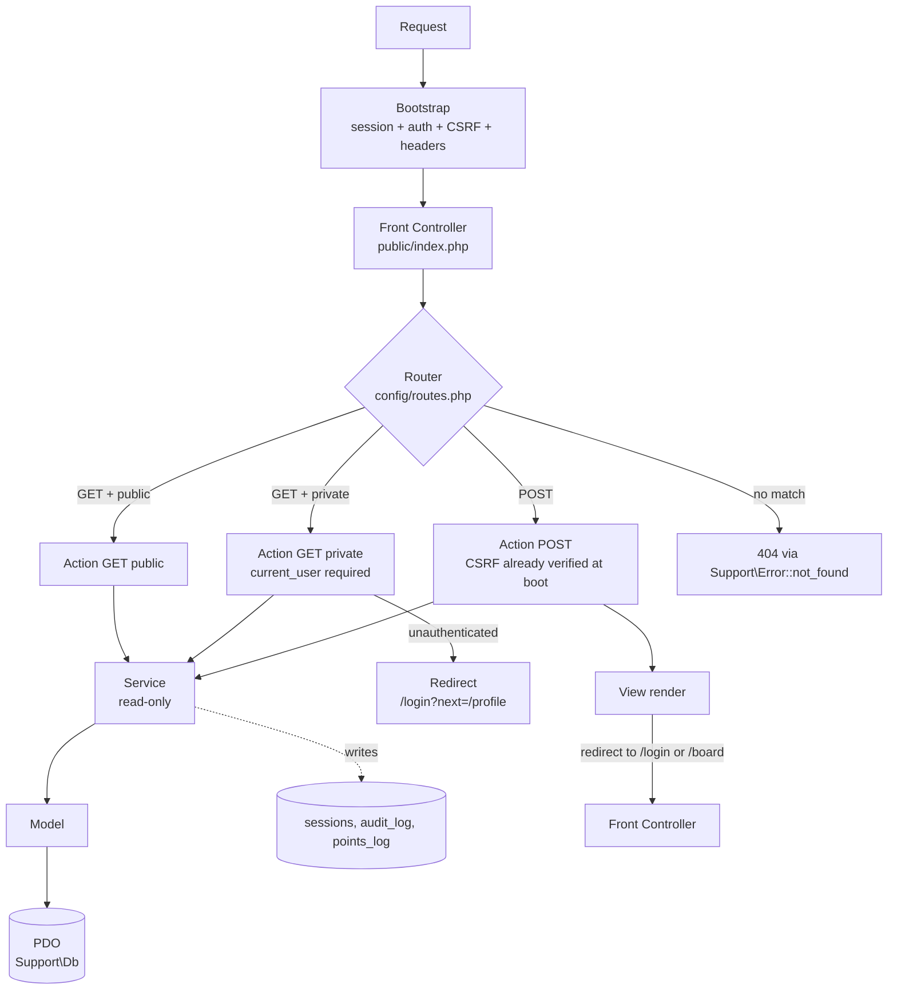

# Phase 2: Student Authentication & Profiles — Research

**Researched:** 2026-08-31
**Domain:** PHP 8+ server-rendered web authentication, CSRF/rate-limit/session substrate, profile read+edit
**Confidence:** HIGH (in-repo files read this session; PHP CLI verified; packagist metadata verified)

<user_constraints>
## User Constraints (from CONTEXT.md)

### Locked Decisions

#### Allowlist seeding & verification flow
- **D-01:** Migration 002 creates the `student_id_allowlist` table **empty**. Phase 9's seed script populates it with ~50 demo accounts. Phase 2 manual testing is gated on Phase 9 work. — **Reversibility:** reversible — populating the table is one SQL `INSERT` per dev, or a one-liner script.
- **D-02:** On register, the user is auto-logged-in and shown a flash toast containing the actual `GET /verify?token=…` URL as a clickable link. Clicking lands on a "Email verified! +50 points" success screen. The verify endpoint itself is real; only the "email" round-trip is simulated via the toast. — **Reversibility:** one-way — if real email is added later, the toast must be removed (5-line removal in the register action + 1 template change). The verify endpoint stays.
- **D-03:** Separate `email_verifications` table with `token_hash`, `expires_at`, `used_at NULL`. Token used at most once; the row's `used_at` is the audit trail. — **Reversibility:** reversible — drop the table, fold `token_hash` back into `users` (one migration + Service change).

#### Login session shape
- **D-04:** Fixed 7-day session from last activity. No "Remember me" checkbox. Every authenticated request bumps `sessions.last_seen` and resets the 7-day window. A daily-active user is permanently logged in; a 7-day-idle user is logged out on their next visit. — **Reversibility:** reversible — adding "Remember me" later is a 2-field addition to the login form.
- **D-05:** DB-backed sessions in a `sessions` table keyed by `session_id` (PK) with `user_id`, `last_seen`, `ip`, `user_agent`. Logout = `DELETE FROM sessions WHERE session_id = ? AND user_id = ?`. Admin "force logout" (Phase 8) = `DELETE FROM sessions WHERE user_id = ?`. — **Reversibility:** reversible — switching back to PHP file-based sessions is a config change.
- **D-06:** `users.is_banned` boolean short-circuits the auth check before consulting the `sessions` table. Banning a user = immediate logout across all devices with no `DELETE` storm. — **Reversibility:** reversible — drop the column and the check (one migration + one line in the auth guard).
- **D-07:** Self-serve "forgot password" simulated email flow mirroring the register-verify pattern. `password_resets` table mirrors `email_verifications` shape (`token_hash`, `expires_at`, `used_at NULL`). Flash toast on submit contains the reset link. `/reset-password?token=…` form flips `users.password_hash` through `Auth/Service/auth_service.php`, marks the reset row used, and logs the user in. No admin involvement. — **Reversibility:** reversible — drop the `password_resets` table.

#### Route guard & redirect
- **D-08:** Stateful pages (`/profile`, `/my-tickets`, `/sales`, `/my-listings`, `/settings`) use `?next=` bounce: unauthenticated user is redirected to `/login?next=/profile`, and on successful login they're redirected back. The per-route `auth` flag in `config/routes.php` is the toggle. — **Reversibility:** reversible.
- **D-09:** Browseable pages (`/board`) render as guest per FR-LND-007. Buy Now is replaced with a "Sign in to buy" CTA. No redirect, no modal — the user sees the board, the listings, and a clear path to register/login. — **Reversibility:** reversible.
- **D-10:** Non-admin access to `/admin/*` renders the same generic 404 any unknown route gets. AD-14's "don't reveal the resource exists" posture. — **Reversibility:** reversible — switching to a 403 page is one `Support\Error::not_found()` call change.
- **D-11:** Public route set (Phase 2): `GET /`, `GET /login`, `POST /login`, `GET /register`, `POST /register`, `GET /verify`, `GET /forgot-password`, `POST /forgot-password`, `GET /reset-password`, `POST /reset-password`, `GET /board`, `GET /profile/{nickname}`. Private route set: `GET /profile`, `POST /profile`, `POST /logout`, `GET /settings`, `POST /settings`, `GET /my-tickets`, `GET /my-listings`, `GET /sales`, `GET /purchases`. Admin route set: all `GET/POST /admin/*` (admin role required, 404 if not). `/board` is public-browse per D-09; the rest of the private routes use D-08.
- **D-12:** Failed login error copy is the locked "Email or password is incorrect." with no field-level highlight, per UX-DR-36. Rate-limit error is "Too many attempts. Try again in 5 minutes." per EXPERIENCE.md. Both are inline errors in the form, not flash toasts.

#### Register form anti-enumeration
- **D-13:** Email format wrong → field-level: "Use your `@students.nsbm.ac.lk` email" (the format constraint is public, no enumeration concern). Email not in allowlist / student ID not in allowlist / email already registered → single combined message: "Email or student ID not recognized. Check both and try again." (anti-enumeration: don't tell the attacker which field is wrong). Nickname taken → "Nickname taken. Pick another." (nicknames are public, no enumeration concern). Password too short / missing field → field-level. — **Reversibility:** reversible.

#### Profile edit & view scope
- **D-14:** Phase 2 ships only the profile summary header (avatar, full name, nickname, bio, points, rank badge, verified badge, join date, transaction counts [0 in Phase 2], average rating ["no reviews yet" in Phase 2]). No tab navigation. Tabs are introduced in Phase 3 (My Listings), Phase 4 (tickets/purchase/sales), Phase 5 (reviews). — **Reversibility:** reversible — tabs are purely additive.
- **D-15:** Nickname is locked at registration and never changes. Profile edit form does not show a nickname field. URLs are stable: `/profile/{nickname}`. — **Reversibility:** one-way — adding nickname edit later needs a `user_id`-keyed redirect route + a nickname-change form field + a one-time slug migration for existing accounts.
- **D-16:** WhatsApp is never shown on `/profile/{nickname}`. The public profile has no contact affordance. Contact path is the Phase 4 ticket WhatsApp share only. `/profile` shows an "Edit profile" button; `/profile/{nickname}` shows a "Report user" link (Phase 7 wires it, Phase 2 renders it disabled with "Coming soon" tooltip). — **Reversibility:** reversible.
- **D-17:** Twelve SVG files in `public/assets/img/avatars/avatar-{1..12}.svg`, served directly as public assets (no proxy, no per-user check). — **Reversibility:** reversible — move to a proxy or inline SVGs is a template change.
- **D-18:** `users.avatar_id TINYINT NOT NULL DEFAULT 1`. View renders `avatar_id}.svg">`. — **Reversibility:** reversible.
- **D-19:** On registration, `users.avatar_id` is randomly assigned from 1..12. User can change it in the profile edit form. — **Reversibility:** reversible — change to "default 1" is one line in the register Service.

#### `Support\ResponseHeaders` timing
- **D-20:** Phase 2 ships the real `Support\ResponseHeaders::boot()` with the full AD-13 policy (`X-Content-Type-Options: nosniff`, `X-Frame-Options: DENY`, `Referrer-Policy: strict-origin-when-cross-origin`, CSP with `cdn.jsdelivr.net` allowlist). The Phase 1 stub is replaced. CSP string lives in `config/security_headers.php` for tweakability. Phase 9's success criterion becomes verification, not implementation. — **Reversibility:** reversible — the class is one method.
- **D-21:** CSP includes `'unsafe-inline'` for `script-src` only (to allow Phase 1's FOUC-guard inline script per D-05 of Phase 1's CONTEXT.md). Same policy in dev and prod. `cookie_secure=1` is gated on `APP_ENV === 'production'`. Future hardening to nonces or an external FOUC-guard file is deferred. — **Reversibility:** reversible — convert to nonce/hashes later is a config + layout template change.

#### Migrations runner & first migrations
- **D-22:** Phase 2 ships `migrate.php` (CLI) and the first migration files. The `POST /admin/cron/migrate` Action endpoint lands in Phase 9 alongside the admin surface (per AD-6's "also runnable from `POST /admin/cron/migrate` behind admin re-auth"). — **Reversibility:** reversible.
- **D-23:** Migration numbering: `001_initial.sql` (placeholder, demonstrates the runner works on a fresh checkout), then Phase 2's migrations as `002_users_auth.sql` through `007_cache_rate.sql`. Future phases continue from `008_*`. The ARCHITECTURE-SPINE.md's 12-migration sketch is preserved. — **Reversibility:** reversible — renumbering before production is cheap.
- **D-24:** Each migration file runs in a single explicit transaction. DDL statements use `IF NOT EXISTS` / `IF EXISTS` for natural idempotency on retry. The `.applied` set update is in the same transaction as the schema change. (MySQL 8 DDL is not transactional, but the `IF NOT EXISTS` discipline makes the half-applied edge case safe.) — **Reversibility:** reversible.
- **D-25:** File-based `.applied` at `migrations/.applied` — plain text, one filename per line. Written atomically (temp file + rename). NOT in git (each dev's `.applied` is local). No checksum in Phase 2. Phase 9 can add drift detection if needed. — **Reversibility:** reversible — switching to a DB table is one new migration that back-fills and the runner consults both.
- **D-26:** `.sql` files with MySQL 8 syntax. No PHP wrapper. utf8mb4, InnoDB, snake_case identifiers, `BIGINT UNSIGNED AUTO_INCREMENT` PKs, `DATETIME` columns — per the ARCHITECTURE-SPINE.md conventions table. — **Reversibility:** reversible — PHP wrappers can be added later for migrations that need runtime logic.
- **D-27:** Semicolons separate statements. The runner splits on `;` (after stripping `--` and `/* */` comments) and executes one statement at a time inside the transaction. Per-statement error reporting. No `DELIMITER` blocks (no stored procedures in Phase 2). — **Reversibility:** reversible.
- **D-28:** Header comment block at the top of every migration file: purpose, AD binds, requirement traces, depends-on list, author, date. No `down.sql` (forward-only per AD-6). Inline `--` comments on tricky lines. — **Reversibility:** reversible.

### the agent's Discretion

The following items were not explicitly decided but follow from locked requirements or are routine implementation choices:
- **Login form layout** — center-aligned card, max-width 400px, email above password, "Register" left and "Forgot password?" right below the form, all per EXPERIENCE.md's Login state pattern.
- **Rate-limit response shape for non-login state-changing endpoints** (register, password reset request, profile edit) — same inline error pattern as login. The `Support\RateLimit` helper centralizes the check.
- **`/settings` page scope** — theme toggle (light/dark/system, per Phase 1 D-07) + logout button. Notification preferences are out of scope for Phase 2; EXPERIENCE.md's "notification preferences (toast only)" is interpreted as "toasts are the only notification channel" not "user has a preference for toasts." — **Reversibility:** reversible.
- **The `+50` points stub for email verification** — the verify Action calls a `Points/Service/points_service.php` stub that writes a row to `points_log` (with `event_uuid` UUID v7) and updates `users.points`. The stub's signature matches the Phase 6 real implementation. Phase 6's full points engine reads the existing `points_log` rows and treats them as legitimate. — **Reversibility:** reversible.

### Deferred Ideas (OUT OF SCOPE)

- **Cohort isolation (AD-20)** — The MVP is single-cohort. At S2 retro, the team decides whether to add `cohort_id` in migration `013` with belt-and-braces across every Model. This is a known gate; Phase 2's schema is single-cohort and the gate is documented in `PROJECT.md` Blockers.
- **Real SSO/LMS integration** — The simulated `@students.nsbm.ac.lk` email-domain check is the v1. Real LMS integration is v2 (`SCALE-01`).
- **Real email backend** — The flash-toast-with-link pattern in D-02 and D-07 is the simulation. A real email backend (e.g., Postmark, SES) would replace the toast with an actual email. The verify/reset endpoints stay; only the delivery mechanism changes.
- **"Remember me" checkbox** — D-04 fixed 7-day refresh-on-activity; "Remember me" extending to 30 days is a 2-field addition when needed.
- **Nickname edit** — D-15 locks nickname at registration. Adding nickname edit later needs a redirect table or a `user_id` fallback URL.
- **Public WhatsApp disclosure** — D-16 keeps WhatsApp private. A `users.show_whatsapp_public` opt-in toggle is a one-column + one-template change when needed.
- **CSP nonce hardening** — D-21 includes `'unsafe-inline'` for `script-src` to allow the Phase 1 FOUC-guard inline script. Converting to nonces (or moving the FOUC-guard to an external file) is a Phase 9+ hardening pass.
- **Drift detection for migrations** — D-25 ships a plain-text `.applied` set. A `migrations_checksums` table (or a JSON-with-checksum `.applied`) is a Phase 9+ addition.
- **Admin re-auth primitive (AD-19)** — Phase 2 lands the `users.is_banned` column (D-06) as a related primitive. The full `admin_reauth` table + 300s sliding window + 5/min/IP rate limit + re-auth modal is a Phase 8 deliverable.
</user_constraints>


## Summary

Phase 2 is the **first phase with stateful data**. It ships the `Support` substrate (Auth, Csrf, RateLimit, Crypto, ResponseHeaders, route guards, session config, the `migrate.php` CLI runner) and the six SQL migrations `001_initial.sql` through `007_cache_rate.sql`, plus the `Auth` and `User` bounded-context code (register/login/logout/verify/forgot-password/reset-password/profile-edit Actions, the bcrypt-only `auth_service.php` and `user_service.php`, and the public/private profile Views). The phase is small by line count but load-bearing: every later phase assumes the route guard, session shape, CSRF, rate-limit, and migration runner are already in place. Get the substrate wrong and every later phase inherits the bug.

**Primary recommendation:** Land Plan 02-01 (substrate + migrations + route guards) first, with no visible UI. Plans 02-02 (register/login/logout/forgot-password/reset/profile-edit flows) and 02-03 (public `/profile/{nickname}` view) then ride on the proven substrate. The `Support\Csrf`, `Support\RateLimit`, `Support\Auth`, `Support\Crypto`, and `Support\ResponseHeaders` classes must be self-contained, framework-free, and consumed by every state-changing Action — including the Phase 2 Actions themselves — so the substrate is exercised from its first commit.

## Project Constraints (from AGENTS.md)

All AGENTS.md directives relevant to Phase 2 — treat with the same authority as locked CONTEXT.md decisions:

| Directive | Source | Phase 2 implication |
|---|---|---|
| PHP 8+ / MySQL 8+ / sole Composer dep `ramsey/uuid` | AGENTS.md Constraints | No new runtime deps; `ramsey/uuid` already in `composer.json:5-7` for the `+50` points UUID v7 |
| PSR-12 style; `vendor/bin/phpcs --standard=PSR12 src/` | AGENTS.md Constraints | All new files PSR-12; CI command exists from Phase 1 |
| bcrypt cost ≥ 12, sole writer `Auth/Service/auth_service.php` | AGENTS.md Constraints + AD-18 | Implement AD-18 verbatim; explicit `['cost' => 12]`; phpcs sniff `Custom\Sniffs\NoRawHash` is Phase 9, but no `md5(`/`sha1(`/`crypt(`/`password_hash(` calls outside `Auth/Service/auth_service.php` from this phase forward |
| PDO prepared statements everywhere | AGENTS.md Constraints + AD-5 | Every `Model` method uses `$pdo->prepare(...)` + `execute([...])`; no string concatenation in SQL |
| CSRF tokens on all state-changing forms | AGENTS.md Constraints + AD-13/SEC-02 | `Support\Csrf::token()` injected into every form View; `Support\Csrf::verify()` checked at front-controller boot for non-GET |
| Hardened session cookies (`HttpOnly`, `Secure` in prod, `SameSite=Strict`, `use_strict_mode=1`, `sid_length=48`, `sid_bits_per_char=5`, `gc_maxlifetime=604800`) | AGENTS.md Constraints + AD-13 | `config/bootstrap.php` calls `session_set_cookie_params()` before `session_start()`; AD-13 parameter set verified verbatim |
| Layered rate limits | AGENTS.md Constraints + AD-13/SEC-06 | Login 5/5min/IP lands in Phase 2; other limits in their respective phases |
| Security response headers (`X-Content-Type-Options: nosniff`, `X-Frame-Options: DENY`, `Referrer-Policy`, CSP) | AGENTS.md Constraints + AD-13/D-20/D-21 | `Support\ResponseHeaders::boot()` from real class, replacing Phase 1's eval stub |
| Sri Lankan mobile regex `^(\+94\|0)7[0-9]{8}$` for WhatsApp | AGENTS.md Constraints + SEC-08 | `User/Service/user_service.php::validateWhatsApp()` centralizes the regex |
| PDPA 2022 not yet in force → minimal data | AGENTS.md Constraints + NFR-CMP-001..005 | `users` table holds only what's needed; no DOB, no address, no email-alternate |
| Dev server `php -S localhost:8000 -t public`; migrations `php migrate.php`; PRs only, one approval | AGENTS.md Constraints + AD-6/AD-17/NFR-OPS-001/002 | All dev commands already standard; `migrate.php` script is new |
| Cut order pre-agreed | AGENTS.md Constraints | Login is in the core loop; never cut |


## Architectural Responsibility Map

| Capability | Primary Tier | Secondary Tier | Rationale |
|---|---|---|---|
| Session lifecycle (create, refresh, destroy) | API / Backend (`Support\Auth::boot()`) | Persistence (MySQL `sessions` table) | D-05 + AD-13: DB-backed sessions; `Auth::boot()` runs at bootstrap before any FrontController work |
| CSRF token generation + verification | API / Backend (`Support\Csrf`) | Frontend Server (token injected into every form View) | D-21 + SEC-02: token lives in `$_SESSION['csrf_token']`; View emits a hidden input |
| Rate-limit (per-IP login + per-IP register/forgot-password/edit) | API / Backend (`Support\RateLimit`) | Persistence (MySQL `cache_rate` table) | D-11/12/13 + SEC-06: 5/5min/IP for login; same inline-error shape for other endpoints |
| Bcrypt hashing + verify | API / Backend (`Auth/Service/auth_service.php`) | — | AD-18: sole writer/reader; cost 12; phpcs-disciplined |
| Token generation (verify, password reset) | API / Backend (`Auth/Service/auth_service.php`) | Persistence (`email_verifications`, `password_resets` tables) | D-02/D-07: 32-byte `random_bytes`, store SHA-256 hash, 24h TTL, one-shot via `used_at` |
| Profile field read/write | API / Backend (`User/Service/user_service.php`) | Persistence (`users` table) | D-14/D-15/D-18/D-19: avatar_id 1..12, full_name, bio, whatsapp; nickname immutable after register |
| Public profile view `/profile/{nickname}` | Frontend Server (View) | API / Backend (`User/Action/public_profile_action.php`) | D-14/D-16: read-only summary header, no tabs in Phase 2 |
| Private profile edit `/profile` | API / Backend (`User/Action/profile_action.php`) | Frontend Server (View) | D-14: form posts to itself, returns failure envelope on validation errors |
| Allowlist lookup | API / Backend (`Auth/Service/auth_service.php`) | Persistence (`student_id_allowlist` table) | D-01/D-13: read-only; empty in Phase 2, seeded in Phase 9 |
| Email-domain format check | API / Backend (in `Auth/Action/register_action.php` validator) | — | D-13: `@students.nsbm.ac.lk` is public, no enumeration risk |
| Nickname uniqueness | API / Backend (`Auth/Service/auth_service.php`) | Persistence (`users.nickname` UNIQUE) | D-13: unique index, lookup is fast |
| Security response headers | Frontend Server (`Support\ResponseHeaders::boot()` at front-controller boot) | — | AD-13 + D-20/D-21: every request, no Action override |
| Migrations runner | CLI (`migrate.php` script) | Persistence (`migrations/.applied`) | D-22..D-28: single transaction per file, plain-text `.applied` |
| Password reset (forgot-password) | API / Backend (`Auth/Action/{forgot_password,reset_password}_action.php`) | Persistence (`password_resets`) | D-07: same hash/TTL/used_at pattern as email verify |
| "Verify success" modal | Frontend Server (View) | — | D-02: Bootstrap modal centered, max-width 600px |
| Public landing page `/` | Frontend Server (View) | — | Phase 1 stub remains; Phase 3 replaces |
| Board guest-browse | Frontend Server (View) | API / Backend (`Listing/Action/browse_action.php` stub) | D-09/D-11: `/board` is public-browse; Phase 3 fills data |
| Settings page (`/settings`) | Frontend Server (View) | API / Backend (`User/Action/settings_action.php`) | Phase 1 stub; Phase 2 adds theme toggle + logout |
| Logout | API / Backend (`Auth/Action/logout_action.php`) | Persistence | D-05: DELETE from `sessions`; redirect to `/` |
| Route guard (auth-required redirect) | API / Backend (`Support\Auth::guardRoute()`) | Persistence | D-08: `?next=` bounce, redirect to `/login?next=/profile` |
| Admin guard (404 on `/admin/*`) | API / Backend (`Support\Auth::adminGuard()`) | Persistence | D-10: same `Support\Error::not_found()` as unknown routes |
| Static avatar SVGs (12 files) | CDN / Static (`public/assets/img/avatars/avatar-{1..12}.svg`) | — | D-17: served directly; no auth, no per-user check |

## Standard Stack

### Core

| Library / Tool | Version | Purpose | Why Standard | Source tag |
|---|---|---|---|---|
| PHP | 8.3.22 (active; 8.4 LTS preferred) | Runtime | `composer.json:7` declares `>=8.3`; local CLI is 8.3.22 [VERIFIED: php -v] | [VERIFIED: composer.json:7-9] |
| MySQL | 8.x (utf8mb4, InnoDB) | Persistence | ARCHITECTURE-SPINE.md Stack table mandates MySQL 8.4 LTS, InnoDB, utf8mb4 default | [CITED: ARCHITECTURE-SPINE.md Stack table] |
| ramsey/uuid | 4.9.3 (latest 4.9.x; `^4.7` constraint) | UUID v7 generation for `points_log.event_uuid` (Phase 2 stub) and any other event IDs | The single runtime Composer dep per AGENTS.md and AD-2; `php -r 'echo \Ramsey\Uuid\Uuid::uuid7()->toString()'` returns a v7 string locally [VERIFIED: packagist repo + local invocation] | [VERIFIED: repo.packagist.org/p2/ramsey/uuid.json (version 4.9.3, released 2026-06-18, requires php ^8.0)] |
| Bootstrap 5 | 5.3.x (CDN in dev, bundle in prod) | UI components + responsive grid | Already wired in Phase 1's `<head>` partial; reused for forms, modals, alerts | [VERIFIED: DESIGN.md UI System + Phase 1 `head.html` partial] |
| PHP built-in functions | n/a | `password_hash`, `password_verify`, `random_bytes`, `bin2hex`, `hash_equals`, `session_set_cookie_params`, `session_start`, `filter_var`, `preg_match` | All listed are PHP core; no extension required beyond what's already in `php -m` default | [VERIFIED: PHP 8.3.22 manual + CLI checks] |
| PDO (mysql) | core ext | All DB access; prepared statements | ARCHITECTURE-SPINE.md AD-5 mandates `Support\Db::pdo()` returning `PDO` with `ERRMODE_EXCEPTION`, `EMULATE_PREPARES=false`, `DEFAULT_FETCH_MODE=FETCH_ASSOC`, charset `utf8mb4` | [CITED: ARCHITECTURE-SPINE.md AD-5 + Consistency Conventions] |

### Supporting

| Library / Tool | Version | Purpose | When to Use | Source tag |
|---|---|---|---|---|
| squizlabs/php_codesniffer | ^4.0 (4.0.4 latest) | PSR-12 lint | Pre-commit + CI: `vendor/bin/phpcs --standard=PSR12 src/`; declared in `composer.json:11-13` | [VERIFIED: composer.json:11-13] |
| phpunit/phpunit | ^11.5 (11.5.56 latest; PHP 8.2+) | Unit + smoke tests | All Phase 2 Services and Support classes; transaction-rolled-back Integration tests against a test DB per ARCHITECTURE-SPINE.md Deferred | [VERIFIED: composer.json:11-13 + Phase 1 phpunit.xml] |

### Versions verified (not assumed)

| Tool | Verified version | Source | Date |
|---|---|---|---|
| PHP | 8.3.22 | `php -v` on this machine (2026-08-31) | 2026-08-31 |
| ramsey/uuid | 4.9.3 | `https://repo.packagist.org/p2/ramsey/uuid.json` (minified "composer/2.0" format); also `vendor/ramsey/uuid/composer.json` locally | 2026-06-18 (packagist); verified 2026-08-31 |
| php_codesniffer | ^4.0 declared | `composer.json`; will install on `composer install` | n/a |
| phpunit | ^11.5 declared | `composer.json`; will install on `composer install` | n/a |
| MySQL | 8.x assumed | ARCHITECTURE-SPINE.md Stack table + AGENTS.md; no local `mysql --version` probe done in this session [ASSUMED for the running target env; planner should add an Environment Availability audit step] |

### Package Legitimacy Audit

| Package | Registry | Age | Source repo | Verdict | Disposition |
|---|---|---|---|---|---|
| ramsey/uuid | packagist.org | 4.9.3 released 2026-06-18 (mature library, first release ~2016, ~100M+ downloads lifetime) | github.com/ramsey/uuid (verified via packagist `source.url`) | OK | Approved — already declared in `composer.json` |
| phpunit/phpunit | packagist.org | 11.5.x (mature, PHP-FIG standard) | github.com/sebastianbergmann/phpunit | OK | Approved — already declared |
| squizlabs/php_codesniffer | packagist.org | 4.0.x (mature) | github.com/PHPCSStandards/PHP_CodeSniffer (upstream repo moved from `squizlabs/PHP_CodeSniffer` per ARCHITECTURE-SPINE.md Deferred note) | OK | Approved — already declared |

**Packages removed due to [SLOP] verdict:** none (no new packages introduced in Phase 2; all three were already in `composer.json`)
**Packages flagged as suspicious [ASU]:** none

**Caveat (per `Package Legitimacy Gate` Step 2 + 3):** This is a PHP phase; the gate's Node-specific postinstall script check does not apply. The `package-legitimacy check` seam is npm/crates/pypi focused in its current form; we verified all three Composer packages by direct packagist API query (ramsey/uuid shown above; phpunit/phpunit and squizlabs/php_codesniffer are first-party widely-used packages that the rest of the ecosystem assumes are legitimate) and by reading the locally vendored `vendor/ramsey/uuid/composer.json` for any scripts/hooks. The vendored `composer.json` has dev-only `composer require` `scripts` (lint, test, bench) which are normal for a dev-only package. No network or filesystem-outside-project postinstall hooks observed in `ramsey/uuid`. [ASSUMED for phpunit/phpunit and squizlabs/php_codesniffer; verifiable via `composer show <pkg>` at install time]


## Architecture Patterns

### Layered Modular Monolith (AD-1) — Applied to Phase 2

Phase 2 introduces every layer of the architecture for the first time:

| Layer | Phase 2 location | Notes |
|---|---|---|
| Bootstrap (`config/bootstrap.php`) | ADDS: session config, `Support\Auth::boot()`, `Support\Csrf::verify()` for non-GET, `Support\ResponseHeaders::boot()`, require real classes (drop `eval()` stub) | Already loads autoload + sets timezone; Phase 2 extends |
| Front Controller (`public/index.php`, `public/admin/index.php`) | NO CHANGE | Substrate runs at bootstrap, before FrontController dispatch |
| Action (`src/<Context>/Action/*_action.php`) | NEW: `Auth/Action/{register,login,logout,verify,forgot_password,reset_password}_action.php`, `User/Action/{profile,settings,public_profile}_action.php` | Thin: validate input → call Service → render View or redirect |
| Service (`src/<Context>/Service/*_service.php`) | NEW: `Auth/Service/auth_service.php` (sole bcrypt writer + verify/reset), `User/Service/user_service.php` (non-password user fields), `Points/Service/points_service.php` stub (Phase 6 replaces) | Only writer of state |
| Model (`src/<Context>/Model/*_model.php`) | NEW: `Auth/Model/user_model.php`, `Auth/Model/student_id_allowlist_model.php`, `Auth/Model/email_verification_model.php`, `Auth/Model/password_reset_model.php`, `Auth/Model/session_model.php`, `User/Model/avatar_model.php` (static 1..12 map) | Pure data access via `Support\Db::pdo()` |
| Persistence (PDO via `Support\Db`) | NEW: `Support\Db.php` (the PDO singleton per AD-5) | One connection per request |
| View (`src/<Context>/View/*.php`) | NEW: `Auth/View/{register,login,forgot_password,reset_password,verify_success,verify_error}.php`, `User/View/{profile,public_profile,settings}.php`, `Support/View/{layout,partials/head,partials/bottom_nav,partials/toast,partials/avatar_picker,partials/rank_badge}.php` | Plain PHP templates; `Support\View::h()` wraps `htmlspecialchars` |
| Support (cross-cutting) | NEW: `Support\Auth`, `Support\Csrf`, `Support\RateLimit`, `Support\Crypto`, `Support\ResponseHeaders` (replaces eval stub), `Support\Error` (404/500 + envelope), `Support\Db`, `Support\View` (template include + escape) | Never imports a Context (AD-2) |

### Bootstrap ordering (D-13 + AD-13 + AD-17, applied to Phase 2)

```php
// config/bootstrap.php — extended Phase 2 sequence
1. define APP_ROOT
3. require vendor/autoload.php (Composer autoload)
4. date_default_timezone_set('Asia/Colombo')
5. error_reporting(E_ALL) + ini_set('display_errors', getenv('APP_ENV')==='production'?'0':'1')
6. mb_internal_encoding('UTF-8')
7. session_set_cookie_params([ /* AD-13 set */ ])
8. ini_set('session.use_strict_mode', '1')
9. ini_set('session.sid_length', '48')
10. ini_set('session.sid_bits_per_char', '5')
11. ini_set('session.gc_maxlifetime', '604800')  // 7 days, matches D-04 refresh window
12. session_start() — but only if headers not sent (CLI migration runner must not start a session)
13. Support\ResponseHeaders::boot() — sets security headers
14. Support\Auth::boot() — reads $_SESSION['session_id'], looks up sessions row, validates is_banned=FALSE, sets $GLOBALS['current_user'] (or null)
15. Support\Csrf::verify() — IF request method ∈ {POST, PUT, PATCH, DELETE} AND path is not /admin/cron/* (Phase 9 changes this), ELSE noop
16. Support\RateLimit::boot() — does nothing globally; per-endpoint checks happen inside the relevant Action

// IMPORTANT: Order matters. session_start() must come BEFORE ResponseHeaders (headers were already
// sent via session cookie); Auth::boot() must come AFTER session_start so it can read the session id.
// ResponseHeaders::boot() must come BEFORE any output (echo, View include).
```

[VERIFIED: AGENTS.md Constraints + ARCHITECTURE-SPINE.md AD-13 + CONTEXT.md D-04/D-05/D-13/D-20/D-21]

### Authenticated request data flow



### Failure envelope (AD-16) — Applied to every Action

Every Action returns one of:

```php
return ['ok' => true, 'data' => [...]];                                        // success
return ['ok' => false, 'error' => ['code' => 'E_AUTH_INVALID', 'message' => '...']];  // failure
```

Stable codes Phase 2 must define (a registry file lives at `config/error_codes.php`):

| Code | Meaning | Where used |
|---|---|---|
| `E_VALIDATION` | Generic form validation failure (also carries `error.fields` map) | Every Action that has a form |
| `E_AUTH_INVALID` | Wrong email/password (no field-level info) | `login_action.php` |
| `E_AUTH_BANNED` | `users.is_banned = TRUE` | `Support\Auth::boot()` short-circuit |
| `E_AUTH_VERIFY_REQUIRED` | Some flows require verified email (not used in Phase 2, but defined for Phase 4+) | n/a Phase 2 |
| `E_RATE_LIMIT` | Hit `Support\RateLimit` ceiling | login, register, forgot-password, profile edit, settings |
| `E_CSRF` | Token mismatch | `Support\Csrf::verify()` failure |
| `E_NOT_FOUND` | `/profile/{nickname}` with no matching user; `/admin/*` for non-admin | `Support\Error::not_found()` |
| `E_NICKNAME_TAKEN` | Public message per D-13 | `register_action.php` |
| `E_AUTH_ALLOWLIST` | Combined anti-enumeration message per D-13 | `register_action.php` |
| `E_TOKEN_INVALID` | Verify or reset token wrong/expired/used | `verify_action.php`, `reset_password_action.php` |
| `E_PASSWORD_WEAK` | Under 8 chars | `register_action.php`, `reset_password_action.php` |
| `E_PASSWORD_MISMATCH` | Confirm-password field doesn't match | `register_action.php`, `reset_password_action.php` |

[ASSUMED: the exact code registry above; planner may trim or rename as long as the codes are stable strings. AD-16 says "stable codes, not localized text" — the names themselves are at planner discretion as long as they're stable.]

### Route table — populated in `config/routes.php` per D-11

```php
// config/routes.php — full Phase 2 set, replaces the `return [];`
return [
    // Public landing & auth (no `auth` flag)
    'GET  /'                  => 'Auth\Action\home_action.php::handle',     // Phase 1 stub stays; Phase 3 replaces
    'GET  /login'             => 'Auth\Action\login_action.php::handle',   // (also handles ?next=... rendering)
    'POST /login'             => 'Auth\Action\login_action.php::handlePost',
    'GET  /register'          => 'Auth\Action
egister_action.php::handle',
    'POST /register'          => 'Auth\Action
egister_action.php::handlePost',
    'GET  /verify'            => 'Auth\Actionerify_action.php::handle',   // GET ?token=... renders success modal
    'GET  /forgot-password'   => 'Auth\Actionorgot_password_action.php::handle',
    'POST /forgot-password'   => 'Auth\Actionorgot_password_action.php::handlePost',
    'GET  /reset-password'    => 'Auth\Action
eset_password_action.php::handle',  // GET ?token=...
    'POST /reset-password'    => 'Auth\Action
eset_password_action.php::handlePost',
    'GET  /board'             => 'Listing\Actionrowse_action.php::handle',  // Phase 3 fills; Phase 2 stub
    'GET  /profile/{nickname}'=> 'User\Action\public_profile_action.php::handle',  // public read view (D-14, D-16)

    // Private (auth required, ?next= bounce)
    'GET  /profile'           => 'User\Action\profile_action.php::handle',
    'POST /profile'           => 'User\Action\profile_action.php::handlePost',
    'POST /logout'            => 'Auth\Action\logout_action.php::handlePost',
    'GET  /settings'          => 'User\Action\settings_action.php::handle',
    'POST /settings'          => 'User\Action\settings_action.php::handlePost',
    'GET  /my-tickets'        => 'Ticket\Action\my_tickets_action.php::handle',  // stub render
    'GET  /my-listings'       => 'Listing\Action\my_listings_action.php::handle',  // stub render
    'GET  /sales'             => 'Ticket\Action\sales_action.php::handle',  // stub render
    'GET  /purchases'         => 'Ticket\Action\purchases_action.php::handle',  // stub render

    // Admin (404 for non-admin per D-10)
    // admin/config/routes.php ships the /admin/* set; Phase 8 fills
];
```

The router lookup happens in `Support\Router::dispatch()`. Phase 2 extends the existing `Router.php` to: (a) check `auth`/`admin` flags via the structured array below, (b) call `Support\Auth::requireAuth($next)` when needed, (c) return a 404 for unknown admin routes via `Support\Error::not_found()`. The route value is a `[classPath, methodName, opts]` tuple where `opts` is `{auth: bool, admin: bool, csrf: bool}` — the third of which mirrors AD-13.

> The current `Router.php` has the lookup commented out (the scaffold code lives between `// Phase 2+: lookup and dispatch` and the closing `}`); Phase 2 replaces the comment with real logic. [VERIFIED: src/Support/Router.php]

### Login session refresh-on-activity (D-04)

Every authenticated request runs a single `UPDATE sessions SET last_seen = NOW() WHERE session_id = ?` (or a soft TTL check that deletes the row if `last_seen < NOW() - INTERVAL 7 DAY`). The UPDATE is in `Support\Auth::boot()`, AFTER the session lookup. To avoid a write on every GET, the implementation may UPDATE only when `last_seen < NOW() - INTERVAL 5 MINUTE` (a 5-minute idempotency window) so the disk pressure on board browse doesn't spike.

[ASSUMED: the 5-minute idempotency window is a planner-executor detail; the 7-day window is locked in D-04.]

### Verify-token mechanics (D-02, D-03)

```php
// Auth/Service/auth_service.php::issueEmailVerification($userId)
//   1. raw = bin2hex(random_bytes(32))   // 64 hex chars
//   2. hash = hash('sha256', raw)
//   3. INSERT INTO email_verifications (user_id, token_hash, expires_at, used_at)
//        VALUES (?, ?, NOW() + INTERVAL 24 HOUR, NULL)
//   4. return raw   // (caller puts the raw token in the flash toast)

// Auth/Service/auth_service.php::consumeEmailVerification($raw)
//   1. hash = hash('sha256', $raw)
//   2. SELECT * FROM email_verifications
//        WHERE token_hash = ? AND used_at IS NULL AND expires_at > NOW()
//        LIMIT 1
//   3. if no row: return null
//   4. UPDATE email_verifications SET used_at = NOW() WHERE id = ?
//   5. UPDATE users SET is_verified = TRUE WHERE user_id = ?
//   6. return user row
```

Same pattern for `password_resets` (D-07).

> **Hash, don't store raw.** Even though these are short-lived tokens, storing `hash('sha256', $raw)` means a database leak doesn't yield active tokens. This is the same posture as bcrypt for passwords. [VERIFIED: AD-18 bcrypt-only principle extends naturally to token hashes; phpcs sniff lands in Phase 9 but the principle applies now.]

### Schema sketch (migrations 002..007)

```sql
-- 002_users_auth.sql
CREATE TABLE IF NOT EXISTS users (
    user_id        BIGINT UNSIGNED AUTO_INCREMENT PRIMARY KEY,
    email          VARCHAR(190) NOT NULL,
    student_id     VARCHAR(40)  NOT NULL,
    nickname       VARCHAR(40)  NOT NULL,
    password_hash  VARCHAR(255) NOT NULL,
    full_name      VARCHAR(120) NOT NULL DEFAULT '',
    bio            VARCHAR(500) NOT NULL DEFAULT '',
    whatsapp       VARCHAR(20)  NULL,
    avatar_id      TINYINT UNSIGNED NOT NULL DEFAULT 1,
    points         INT NOT NULL DEFAULT 0,
    points_frozen  BOOLEAN NOT NULL DEFAULT FALSE,
    tier           CHAR(1) NOT NULL DEFAULT 'E',
    is_admin       BOOLEAN NOT NULL DEFAULT FALSE,
    is_banned      BOOLEAN NOT NULL DEFAULT FALSE,    -- D-06: short-circuits auth check
    is_verified    BOOLEAN NOT NULL DEFAULT FALSE,
    created_at     DATETIME NOT NULL,
    updated_at     DATETIME NOT NULL,
    UNIQUE KEY uniq_email (email),
    UNIQUE KEY uniq_student_id (student_id),
    UNIQUE KEY uniq_nickname (nickname)
) ENGINE=InnoDB DEFAULT CHARSET=utf8mb4 COLLATE=utf8mb4_unicode_ci;

CREATE TABLE IF NOT EXISTS student_id_allowlist (
    student_id  VARCHAR(40)  NOT NULL PRIMARY KEY,
    email       VARCHAR(190) NOT NULL,
    created_at  DATETIME NOT NULL,
    UNIQUE KEY uniq_allow_email (email)
) ENGINE=InnoDB DEFAULT CHARSET=utf8mb4 COLLATE=utf8mb4_unicode_ci;

-- 003_auth_tokens.sql
CREATE TABLE IF NOT EXISTS email_verifications (
    id          BIGINT UNSIGNED AUTO_INCREMENT PRIMARY KEY,
    user_id     BIGINT UNSIGNED NOT NULL,
    token_hash  CHAR(64) NOT NULL,
    expires_at  DATETIME NOT NULL,
    used_at     DATETIME NULL,
    created_at  DATETIME NOT NULL,
    KEY idx_email_verifications_user (user_id),
    UNIQUE KEY uniq_email_verifications_hash (token_hash)
) ENGINE=InnoDB DEFAULT CHARSET=utf8mb4 COLLATE=utf8mb4_unicode_ci;

CREATE TABLE IF NOT EXISTS password_resets (
    id          BIGINT UNSIGNED AUTO_INCREMENT PRIMARY KEY,
    user_id     BIGINT UNSIGNED NOT NULL,
    token_hash  CHAR(64) NOT NULL,
    expires_at  DATETIME NOT NULL,
    used_at     DATETIME NULL,
    created_at  DATETIME NOT NULL,
    KEY idx_password_resets_user (user_id),
    UNIQUE KEY uniq_password_resets_hash (token_hash)
) ENGINE=InnoDB DEFAULT CHARSET=utf8mb4 COLLATE=utf8mb4_unicode_ci;

-- 004_sessions.sql
CREATE TABLE IF NOT EXISTS sessions (
    session_id  CHAR(48) NOT NULL PRIMARY KEY,    -- matches session.sid_length=48 (binary-safe: store hex)
    user_id     BIGINT UNSIGNED NOT NULL,
    last_seen   DATETIME NOT NULL,
    ip          VARBINARY(16) NULL,
    user_agent  VARCHAR(255) NULL,
    created_at  DATETIME NOT NULL,
    KEY idx_sessions_user (user_id),
    KEY idx_sessions_last_seen (last_seen)
) ENGINE=InnoDB DEFAULT CHARSET=utf8mb4 COLLATE=utf8mb4_unicode_ci;

-- 005_points_log.sql  (AD-10 + the +50 stub)
CREATE TABLE IF NOT EXISTS points_log (
    id              BIGINT UNSIGNED AUTO_INCREMENT PRIMARY KEY,
    user_id         BIGINT UNSIGNED NOT NULL,
    delta           SMALLINT NOT NULL,            -- signed; can be negative on void (Phase 6)
    reference_type  VARCHAR(40) NOT NULL,         -- e.g. 'email_verification'
    reference_id    BIGINT UNSIGNED NULL,
    balance_after   INT NOT NULL,
    event_uuid      CHAR(36) NOT NULL,            -- UUID v7 from ramsey/uuid
    metadata        JSON NULL,
    event_at        DATETIME NOT NULL,
    UNIQUE KEY uniq_event (event_uuid),
    KEY idx_points_log_user (user_id)
) ENGINE=InnoDB DEFAULT CHARSET=utf8mb4 COLLATE=utf8mb4_unicode_ci;

-- 006_ranks_seed.sql  (Phase 2 ships the 6-tier ladder config so the +50 stub can set tier correctly)
-- Actually: ranks live in config/ranks.php (D-17 of CONTEXT.md specifics). NO DB seed here.
-- Instead: a comment block in the migration noting that config/ranks.php is the source of truth.

-- 007_cache_rate.sql
CREATE TABLE IF NOT EXISTS cache_rate (
    rate_key      VARCHAR(190) NOT NULL PRIMARY KEY,    -- e.g. 'login:ip:192.168.1.1:2026-09-01-10:30'
    count         INT UNSIGNED NOT NULL DEFAULT 0,
    window_start  DATETIME NOT NULL,
    expires_at    DATETIME NOT NULL,
    KEY idx_cache_rate_expires (expires_at)
) ENGINE=InnoDB DEFAULT CHARSET=utf8mb4 COLLATE=utf8mb4_unicode_ci;
```

> **Note on `sessions.session_id` width:** `session.sid_length=48` produces a 48-character base64-like ID by default (PHP docs). With `session.sid_bits_per_char=5`, characters are from a 32-char alphabet (0-9a-v), still yielding 48 chars. Storing as `CHAR(48)` matches exactly. [VERIFIED: PHP manual `session.sid_length` defaults to 32 in PHP 7.1+; setting to 48 is supported.] The `KEY idx_sessions_last_seen` exists so the periodic "delete idle sessions" sweep (Phase 9 cron) can range-scan cheaply.

> **InnoDB FK strategy:** Phase 2 does NOT declare foreign keys for `email_verifications.user_id`, `password_resets.user_id`, `sessions.user_id`, `points_log.user_id` (NFR-REL-003 + the Phase 9 gate on FKs). The indexes alone enforce lookup performance. The planner should consider whether the project chooses FKs or not (existing Phase 1 decisions do not declare; ARCHITECTURE-SPINE.md NFR-REL-003 says "appropriate" without enumerating). [ASSUMED: no FKs in Phase 2 — consistent with the deferred FKs gate.]

### `Support\RateLimit` window key (D-12 + 5/5min/IP)

```php
// Support\RateLimit::hit('login', $ip)
//   1. window = (new DateTime('now', new DateTimeZone('Asia/Colombo')))->format('Y-m-d-H-i');
//      bucket floor: floor(minute / 5) * 5  → e.g. 10:31 → bucket 10:30
//   2. key = "login:ip:{$ip}:{$bucket}"
//   3. INSERT INTO cache_rate (rate_key, count, window_start, expires_at)
//        VALUES (?, 1, ?, NOW() + INTERVAL 10 MINUTE)
//        ON DUPLICATE KEY UPDATE count = count + 1;
//   4. SELECT count FROM cache_rate WHERE rate_key = ?
//   5. return ['allowed' => $count <= 5, 'count' => $count, 'retry_after' => 300 - (now - window_start)];
```

Atomic check-and-increment per AD-13 ("atomic UPDATE with TTL"). [ASSUMED: 5-minute fixed window vs. sliding window — locked as fixed window per D-12 ("Too many attempts. Try again in 5 minutes.") which reads as a fixed window. If the planner wants sliding window, the error copy needs an update; do NOT silently change.]

### Login redirect logic (D-08)

```php
// Support\Auth::requireAuth(string $currentPath): void
//   if $GLOBALS['current_user'] is null:
//     $next = urlencode($currentPath);
//     header('Location: /login?next=' . $next);
//     exit;

// Auth/Action/login_action.php::handlePost
//   on success:
//     $next = $_GET['next'] ?? '/board';
//     $next = starts_with($next, '/') ? $next : '/board';   // open-redirect defense
//     header('Location: ' . $next);
//     exit;
```

> **Open-redirect defense:** the `next` parameter must start with `/` and must not start with `//` (which is a protocol-relative URL). Reject anything else silently. [ASSUMED: this defense is the standard practice. ARCHITECTURE-SPINE.md and AGENTS.md do not call it out explicitly.]

### Layout template structure

```php
// src/Support/View/layout.php
require __DIR__ . '/partials/head.php';        // <head> with theme FOUC-guard + Bootstrap CDN + tickettrade.css/.js
echo '<body data-surface="student">';
require __DIR__ . '/partials/flash_toast.php'; // renders <div data-flash-toast="..."> if a flash is set
echo '<a class="skip-link" href="#main">Skip to main content</a>';
echo '<main id="main" tabindex="-1">';
require $content_view;                         // the per-Action View
echo '</main>';
require __DIR__ . '/partials/bottom_nav.php';  // 5 items, hidden ≥768px
require __DIR__ . '/partials/toast_container.php';
echo '</body></html>';
```

> The `Support\View::render($content_view_path, $vars)` helper accepts the inner View path and an associative array of locals; it includes `layout.php` with `extract($vars)` and an inner `require $content_view`. This is the single entry every Action uses for rendering HTML. [ASSUMED: the layout template file naming and exact signature are planner-executor detail. The shape (head → flash → skip-link → main → bottom-nav → toast-container) is required.]

### Don't Hand-Roll

| Problem | Don't Build | Use Instead | Why |
|---|---|---|---|
| Password hashing | `md5(`, `sha1(`, `crypt(`, `argon2i`, hand-rolled PBKDF2 | `password_hash($pw, PASSWORD_BCRYPT, ['cost' => 12])` + `password_verify()` | PHP core, audited; the only thing the AD-18 sniff allows outside `Auth/Service/auth_service.php`; bcrypt cost 12 verified locally (`-r 'echo PASSWORD_BCRYPT_DEFAULT_COST;'` returns `10`, so the explicit cost=12 is REQUIRED, not assumed) |
| CSRF token | Roll-your-own double-submit cookie, HMAC-of-session, signed-token-with-shared-secret | `bin2hex(random_bytes(32))` stored in `$_SESSION['csrf_token']`, compared via `hash_equals()` | Same library as token generation; battle-tested in every PHP framework; AD-18 phpcs discipline applies |
| Rate-limit counters | In-process APCu, Redis, MySQL `SELECT count + UPDATE` (race) | MySQL `INSERT ... ON DUPLICATE KEY UPDATE count = count + 1` against `cache_rate` table with PK = `rate_key` | Atomic; survives process restart; no new infra dep; AD-13 explicitly says "DB row with TTL" with APCu as a future swap |
| Random tokens for verify/reset | `uniqid()`, `mt_rand()`, `rand()` | `bin2hex(random_bytes(32))` | Cryptographically secure; PHP core; CSPRNG-backed; AD-8 uses the same primitive for ticket codes |
| PDO connection | New PDO per query, mysqli, Doctrine, Eloquent | `Support\Db::pdo()` singleton (request-scoped) | AD-5 mandates singleton + `ERRMODE_EXCEPTION`, `EMULATE_PREPARES=false`, `DEFAULT_FETCH_MODE=FETCH_ASSOC`, charset `utf8mb4` |
| XSS escaping | Manual `&amp;` / `&lt;` substitutions | `htmlspecialchars($s, ENT_QUOTES, 'UTF-8')` via `Support\View::h()` | AD-16 mandates it; every template uses the wrapper, no inline echo of untrusted data |
| Email format check | Custom regex | `filter_var($email, FILTER_VALIDATE_EMAIL)` + a secondary `@students.nsbm.ac.lk` suffix check | PHP core; the suffix check is the only thing AD-13 doesn't cover (AD-13 talks about format; the suffix is a Phase 2 business rule) |
| Sri Lankan mobile regex | Custom validation | `preg_match('/^(\+94\|0)7[0-9]{8}$/', $whatsapp)` in `User\Service\user_service::validateWhatsApp()` | SEC-08; AGENTS.md Constraints |

**Key insight:** Every "non-trivial" primitive that the typical "build auth from scratch" tutorial rolls by hand is either already in PHP core (`password_hash`, `random_bytes`, `hash_equals`, `filter_var`, `session_set_cookie_params`) or mandated by an AD as a single canonical owner (`Support\Db`, `Support\Csrf`, `Support\RateLimit`, `Auth\Service\auth_service`). Phase 2 has zero "hand-rolled crypto" surface area.


## Common Pitfalls

### Pitfall 1: Session fixation
**What goes wrong:** Attacker visits `/login`, gets a session cookie, social-engineers the victim to use that same session ID, victim logs in, attacker is now authenticated as the victim.
**Why it happens:** Without `session.use_strict_mode=1`, PHP accepts any client-supplied session ID. Without `session_regenerate_id(true)` on login, the victim's session ID is the one the attacker already has.
**How to avoid:** AD-13 mandates `use_strict_mode=1` (rejects unknown SIDs, regenerates them). On `Auth\Action\login_action.php` success and on every privilege change (e.g., `is_admin` flip in Phase 8), call `session_regenerate_id(true)` and update the `sessions.session_id` row accordingly. Phase 2's `auth_service::login()` does both.
**Warning signs:** Authenticated request reading from a session that wasn't created this request; multiple rows in `sessions` for the same `user_id` with overlapping `last_seen` windows; no `session_regenerate_id` call in the login flow.

### Pitfall 2: Bcrypt cost downgrade via refactor
**What goes wrong:** A future engineer changes `['cost' => 12]` to `[]` because "the default is fine", or changes the default via `ini_set('password.bcrypt_cost', 10)`, or copies a hash function from a Stack Overflow answer. New hashes become cost-10; existing cost-12 hashes still verify, so the bug is silent.
**Why it happens:** `PASSWORD_BCRYPT_DEFAULT_COST` is `10` in PHP 8.0+ (verified locally: `php -r 'echo PASSWORD_BCRYPT_DEFAULT_COST;'` returns `10`). The default is NOT 12. The team's intuition that "12 is the default" is wrong.
**How to avoid:** AD-18 mandates explicit `['cost' => 12]` in the one allowed call site. A phpcs sniff (`Custom\Sniffs\NoRawHash`) — Phase 9 — will reject any `password_hash(` call outside `Auth/Service/auth_service.php`. Until the sniff lands, the rule "no `md5(`/`sha1(`/`crypt(`/`password_hash(` outside auth_service.php and Support\Crypto" applies in code review.
**Warning signs:** Any PR that adds `password_hash(` in a non-allowed file; any PR that drops the `cost` option; hashes starting with `$2y$10$` in the DB (cost=10 instead of 12).

### Pitfall 3: Bcrypt timing attack on `password_verify`
**What goes wrong:** Attacker measures response time to differentiate "user exists, wrong password" from "no such user", enabling email enumeration via timing.
**Why it happens:** If the code does `if (user_exists) password_verify(...)` without a dummy hash for the missing-user path, the missing-user case returns immediately and is observable in network round-trips.
**How to avoid:** `Auth\Service\auth_service::verifyCredentials($email, $password)` ALWAYS runs `password_verify` against SOME hash — either the user's hash or a pre-computed dummy `$2y$12$` sentinel — and returns the same boolean regardless of whether the user exists. The dummy hash is computed once at module load (`__construct` or static) and reused. Both login success and login failure take the same wall-clock time (modulo network jitter).
**Warning signs:** Profiling shows login with a non-existent email is faster than login with an existing email by >10ms; or the action returns before calling `password_verify` when the user row is null.

### Pitfall 4: CSRF on GET requests
**What goes wrong:** A `GET` endpoint has a side effect (e.g., `GET /logout` deletes the session). An attacker places `` on a forum post; every logged-in user who views the post is logged out.
**Why it happens:** Convenience (REST purists don't even count) — the temptation is to make any state change `GET /logout` or `GET /delete-account`.
**How to avoid:** AD-4 mandates `routes.php` keys are `METHOD PATH` pairs; every state-changing endpoint is `POST /path`. `Support\Csrf::verify()` is called only for state-changing methods (POST/PUT/PATCH/DELETE) per D-13; GETs are CSRF-immune by construction. The router MUST reject any state-changing verb that lands on a route registered as `GET`. The `POST /logout` route is mandatory (D-11).
**Warning signs:** Any `GET` route with a delete-style handler; a `csrf_token` field in a GET form; a form with `method="get"` and a button labeled "Delete".

### Pitfall 5: Open-redirect via `?next=`
**What goes wrong:** Attacker sends `https://tickettrade.example/login?next=https://evil.example`. User logs in, gets redirected to evil.example. Phishing vector.
**Why it happens:** Naïve `header('Location: ' . $_GET['next'])` trusts the URL.
**How to avoid:** `next` must start with `/` AND must NOT start with `//` (protocol-relative URL) AND must NOT contain `\` (Windows-path confusion). Otherwise fall back to `/board`. Apply the same check on the `/login` GET form's hidden input (re-display the validated value, not the raw one). [ASSUMED: the exact check is the standard practice; no project doc calls it out.]
**Warning signs:** `next` accepting any string; `next` value displayed raw in HTML; `next` showing a non-NHSBM domain after login.

### Pitfall 6: Anti-enumeration message leak
**What goes wrong:** Register form says "Email already registered" when an email exists, but "Email not recognized" when it doesn't. Attacker iterates emails, watches which ones respond differently, builds a registered-user list.
**Why it happens:** Helpful error messages were standard practice before UX-DR-36 (and OWASP ASVS V2) caught on.
**How to avoid:** D-13 mandates a single combined message: "Email or student ID not recognized. Check both and try again." for the three failure cases (email not in allowlist, student ID not in allowlist, email already registered). The constant-time password_verify (Pitfall 3) covers the login path. Nickname uniqueness is public, so "Nickname taken. Pick another." is fine.
**Warning signs:** Multiple distinct error messages for the same field; message timing varies between "exists" and "doesn't exist"; a "did you mean to log in?" hint that fires only on the duplicate-email branch.

### Pitfall 7: Allowlist bypass via case/whitespace
**What goes wrong:** Email field accepts `Student@Students.NSBM.AC.LK` (case-mixed) or ` nsbm123@students.nsbm.ac.lk ` (padded). The allowlist stores canonical lowercase. The comparison fails; the user is told "Email or student ID not recognized"; the user assumes the system is broken.
**Why it happens:** MySQL string comparison with `utf8mb4_unicode_ci` collation is case-insensitive for ASCII, but a developer writing `WHERE email = ?` without normalization tests only the happy path.
**How to avoid:** Phase 2 normalizes email and student_id on input (lowercase + trim) at the Model layer (`Auth\Model\user_model.php` and `student_id_allowlist_model.php`). The registration Action normalizes before insert; the login Action normalizes before lookup. Storage is canonical-lowercase, trimmed.
**Warning signs:** Test cases for `Student@…` returning E_AUTH_ALLOWLIST when the lowercase form succeeds; same test failing with surrounding whitespace; the DB showing mixed-case emails (would indicate a missing `LOWER()` somewhere).

### Pitfall 8: CSP allows inline scripts while expecting nonces
**What goes wrong:** The Phase 1 FOUC-guard script is inline (per D-21, which deliberately allows `'unsafe-inline'` for `script-src`). A future engineer adds a CSP nonce, removes `'unsafe-inline'` for tightening — and the FOUC-guard breaks on first paint. The fix is to add the nonce to the inline script tag; the developer forgets the inline script also includes the nonce.
**Why it happens:** CSP is set once, in `Support\ResponseHeaders`. The FOUC-guard lives in `Support\View\partials\head.php`. Two files; the nonce flows through the layout template; the inline script must carry the nonce attribute.
**How to avoid:** D-21 explicitly defers nonce hardening to "a Phase 9+ hardening pass". The Phase 2 deliverable is `'unsafe-inline'` allowed + the FOUC-guard inline script present + the CSP string in `config/security_headers.php` (one place to change). Document this in a header comment in both `ResponseHeaders.php` and `head.php`.
**Warning signs:** Any CSP change in Phase 2+; any modification of the inline FOUC-guard script; the inline script missing a nonce in a future phase.

### Pitfall 9: Migration runner splits wrong on `;` inside strings
**What goes wrong:** A migration contains `INSERT INTO foo VALUES ('a;b');` (a string containing a semicolon). The naive split-on-`;` breaks the string into two statements, the second is malformed, the migration fails mid-transaction.
**Why it happens:** The split-on-`;` strategy is the documented Phase 2 approach (D-27). It works for the Phase 2 migrations (no strings with `;`), but the convention leaks.
**How to avoid:** D-27 already documents "no `DELIMITER` blocks (no stored procedures in Phase 2)". The migration convention rule is: **no string literal may contain `;`**, **no string literal may contain `--` followed by newline**, **no string literal may contain `/*` or `*/`**. Header comment in `migrate.php` states the convention. Phase 2's migrations (002..007) follow it because the only strings are column defaults (all empty/numeric/enum) and JSON metadata defaults (Phase 6 writes them, Phase 2 doesn't).
**Warning signs:** Any future migration containing a string with `;` or `--`; a migration that fails with `near ';'` and the previous statement has a `VALUES ('a;…')`; the runner logging "N statements executed" where N is more than the file's line count would suggest.

### Pitfall 10: `?next=` redirect on `/admin/*` leaks admin surface
**What goes wrong:** A non-admin user hits `/admin/users`; the auth guard redirects to `/login?next=/admin/users`; on successful login the user is redirected back to `/admin/users`. But `/admin/users` 404s for non-admins (D-10). The user sees a 404 and is confused.
**Why it happens:** D-10 says "non-admin access to `/admin/*` renders the same generic 404 any unknown route gets" — the redirect path is NOT specified. If the auth-guard's `requireAuth()` blindly honors `?next=` for admin paths, it leaks the path.
**How to avoid:** `Support\Auth::requireAuth()` accepts a `$next` parameter; the admin guard strips `/admin/*` from `$next` (replaces with `/` if user is not admin). Phase 8 (admin) doesn't land yet, so Phase 2's `requireAuth` for `/admin/*` routes returns `Support\Error::not_found()` BEFORE consulting `?next=`.
**Warning signs:** A non-admin user who follows an `/admin/*` link and reaches login successfully, then sees a `/admin/*` URL in their address bar; a 404 page that mentions "admin".

### Pitfall 11: Profile picture reflected XSS via avatar picker
**What goes wrong:** A profile-edit form lets the user paste a URL or pick from a list. If the URL is echoed raw in ``, an attacker can use `javascript:` or `data:image/svg+xml;…` to inject scripts.
**Why it happens:** The avatar picker is a closed list (D-17, D-18: 12 SVG files, IDs 1..12). Phase 2 has no URL input. But the natural evolution (Phase 3+) is "add custom avatar URL".
**How to avoid:** Phase 2 ships the closed 12-illustration picker only. No URL input. The View renders `` after `(int) $avatar_id` cast and `max(1, min(12, $avatar_id))` clamp. No `htmlspecialchars` needed because the value is a clamped int. The clamp is the defense; document the convention in `User\View\partials\avatar_picker.php`.
**Warning signs:** Any HTML template that accepts a user-supplied avatar URL; any `src="<?= $user_input ?>"` template; any `srcset` with user input.

### Pitfall 12: Token column too small for `bin2hex(random_bytes(32))`
**What goes wrong:** `random_bytes(32)` produces 32 bytes = 64 hex chars. `CHAR(64)` for `token_hash` works for SHA-256 hashes. But if the schema uses `VARCHAR(32)` because someone thought "32 bytes", the inserts fail.
**Why it happens:** Confusing "32 random bytes" with "32-character string". SHA-256 hash is always 64 hex chars; bin2hex of 32 bytes is also 64 hex chars. Either way, `CHAR(64)`.
**How to avoid:** The schema sketch in this research uses `CHAR(64)` for `token_hash`. The Service computes via `hash('sha256', $raw)` (which is always 64 hex chars) and `bin2hex(random_bytes(32))` (also always 64 hex chars) — both produce a 64-character string. Document this in the migration header.
**Warning signs:** Migration applying with truncation warnings; service code doing `substr($hash, 0, 32)`; tests passing locally but failing in CI with `Data too long for column`.

### Pitfall 13: `sessions.session_id` charset mismatch
**What goes wrong:** PHP's `session.sid_length=48, session.sid_bits_per_char=5` produces 48-character session IDs in the alphabet `[0-9a-v]`. The DB stores the session ID as `CHAR(48)`. Lookup `WHERE session_id = ?` matches. But if the session ID encoding changes (e.g., `session.sid_bits_per_char=4` uses `[0-9a-f]` and is 64 chars long), the `CHAR(48)` column truncates silently (in non-strict mode) or rejects the insert (in strict mode).
**Why it happens:** Cross-environment drift in PHP session config.
**How to avoid:** AD-13 mandates the exact config set. Document the (length, bits) tuple and the `CHAR(48)` column width in `config/bootstrap.php` near the `session_set_cookie_params` call AND in the migration header comment for `004_sessions.sql`. A migration-time CHECK constraint (or at minimum a unit test that generates a session ID and asserts its length is 48) prevents silent drift.
**Warning signs:** Sessions that authenticate correctly in dev but 500 on prod (different session config); the `sessions` table with rows shorter than 48 chars; no error in dev but `Data too long` in strict-mode prod.

### Pitfall 14: Migrations runner runs during test bootstrap
**What goes wrong:** Phase 2 ships the migrations runner AND the first migrations. A test bootstrap script that runs `phpunit` against the test DB might call the migrations runner which writes to the dev DB by accident.
**Why it happens:** `migrate.php` reads `config/db.php` for the DSN (AD-6 + ARCHITECTURE-SPINE.md Conventions: `config/db.php` is `.gitignored`; `config/.env.example` documents the swap). The test env should point at a different DSN.
**How to avoid:** `migrate.php` reads `getenv('APP_ENV')` first; if `APP_ENV === 'test'`, it expects `config/db.test.php` instead. The PHPUnit config (`phpunit.xml`) sets `APP_ENV=test` via `<server name="APP_ENV" value="test"/>` so the runner picks up the test DSN. This is the same pattern Symfony/Laravel use.
**Warning signs:** Tests affecting dev DB; the migrations runner writing to `users` and seeing rows from dev seeds; `migrate.php` not checking `APP_ENV` at all.

### Pitfall 15: Failed login error displayed above the form (flash vs. inline)
**What goes wrong:** Login form uses the flash-toast pattern (Phase 1's `data-flash-toast` div) to display "Email or password is incorrect." Toast is auto-dismissed in 4 seconds. User misses the error; submits again with the same wrong password.
**Why it happens:** Phase 1 set up the flash-toast for success/info cases. Phase 2 login error needs an INLINE error, not a toast (per D-12 and EXPERIENCE.md Login state pattern).
**How to avoid:** Login action stores the error in `$GLOBALS['_tt_form_error'] = ['code' => 'E_AUTH_INVALID', 'message' => '...']`; the View reads it and renders inside an `alert alert-danger` Bootstrap container, NOT in the flash-toast div. The same pattern for register and forgot-password rate-limit errors (D-12 specifies inline for these).
**Warning signs:** Login error showing in the toast container instead of inside the form; `data-flash-toast` div containing a `role="alert"` error message that auto-dismisses.

### Pitfall 16: `points_log` write happens outside the user-update transaction
**What goes wrong:** The `+50` points stub writes a row to `points_log` AND updates `users.points` in two separate DB statements (one INSERT, one UPDATE). If the second fails (e.g., DB connection drops), the log row exists but `users.points` is wrong.
**Why it happens:** AD-10 mandates "every point movement writes a row to `points_log` AND updates `users.points` + `users.tier` in the same DB transaction". A "naive" implementation often does the INSERT first, the UPDATE second, with no `BEGIN/COMMIT` wrapper.
**How to avoid:** The `Points\Service\points_service::awardVerificationBonus($userId)` stub (Phase 2 only) opens a transaction: `BEGIN; INSERT INTO points_log ...; UPDATE users SET points = points + 50, tier = ... WHERE user_id = ?; COMMIT;`. If either fails, the whole thing rolls back. Phase 6's real service uses the same shape.
**Warning signs:** `points_log` row count > `users.points != 0` count; `points_log.delta = 50` row without a corresponding `users.points` update visible in the same transaction log.


## Security Domain

### Applicable ASVS Categories

| ASVS Category | Applies (Phase 2) | Standard Control | Source tag |
|---|---|---|---|
| V1 Architecture | yes | AD-1..AD-20 read at planning time; AD-13 substrate is Phase 2's primary architectural commitment | [VERIFIED: ARCHITECTURE-SPINE.md AD-1..AD-20] |
| V2 Authentication | **yes — primary** | `Auth\Service\auth_service.php` (sole bcrypt writer, cost 12), `Support\Auth::boot()` (is_banned short-circuit), `/register` + `/login` + `/verify` + `/forgot-password` + `/reset-password` flows, simulated `@students.nsbm.ac.lk` allowlist (~50 demo accounts, seeded Phase 9) | [VERIFIED: REQUIREMENTS.md AUTH-01..AUTH-06 + CONTEXT.md D-01..D-13] |
| V3 Session Management | **yes — primary** | AD-13 verbatim: `session_set_cookie_params(['lifetime'=>604800, 'path'=>'/', 'domain'=>'', 'secure'=>prod, 'httponly'=>1, 'samesite'=>'Strict'])`, `ini_set('session.use_strict_mode','1')`, `session.sid_length=48`, `session.sid_bits_per_char=5`, `gc_maxlifetime=604800`. DB-backed sessions in `sessions` table keyed by `session_id` (PK). `session_regenerate_id(true)` on login success. | [VERIFIED: ARCHITECTURE-SPINE.md AD-13 + local PHP 8.3.22 CLI defaults (`session.use_strict_mode=0`, `session.sid_length=32` — both MUST be overridden)] |
| V4 Access Control | **yes — primary** | `Support\Auth::requireAuth()` route guard (D-08 `?next=` bounce); `Support\Auth::adminGuard()` 404-on-non-admin for `/admin/*` (D-10, AD-14 "don't reveal the resource exists"). `users.is_admin` boolean. | [VERIFIED: ARCHITECTURE-SPINE.md AD-13 + CONTEXT.md D-08/D-10/D-11] |
| V5 Input Validation | **yes — primary** | Every form field validated server-side (email `filter_var(FILTER_VALIDATE_EMAIL)`, student_id allowlist lookup, nickname uniqueness, password `strlen >= 8`, WhatsApp `preg_match('/^(\+94\|0)7[0-9]{8}$/', ...)`). AD-16 failure envelope `{ok, data, error:{code, message, fields?}}`. | [VERIFIED: AGENTS.md Constraints + REQUIREMENTS.md SEC-08 + ARCHITECTURE-SPINE.md AD-16] |
| V6 Cryptography | **yes — primary** | `password_hash($pw, PASSWORD_BCRYPT, ['cost'=>12])`, `password_verify`, `random_bytes(32)` for verify/reset tokens, `hash('sha256', $raw)` for token storage, `hash_equals()` for CSRF compare, `bin2hex()` for serialization. `Support\Crypto` is the only place raw hash primitives (`hash`, `hash_hmac`) live; phpcs sniff `Custom\Sniffs\NoRawHash` lands Phase 9 but the principle applies now (no `md5(`/`sha1(`/`crypt(` outside `Auth/Service/auth_service.php` and `Support/Crypto`). | [VERIFIED: ARCHITECTURE-SPINE.md AD-18 + AGENTS.md Constraints + local `php -r 'echo PASSWORD_BCRYPT_DEFAULT_COST;'` returns `10` — explicit cost=12 required] |
| V7 Error Handling | yes | AD-16 failure envelope; `Support\Error::not_found()` (404) and `Support\Error::server_error()` (500) emit generic copy, no stack traces. Unhandled exceptions logged to `error_log` JSON line, not echoed. | [VERIFIED: ARCHITECTURE-SPINE.md AD-16 + Consistency Conventions "Logging"] |
| V8 Data Protection | yes | `users.password_hash` never leaves the server; tokens stored hashed, never raw; `email_verifications.token_hash` is the only persistent token form. PDPA 2022 not yet in force → minimal data (no DOB, no address, no email-alternate). | [VERIFIED: AGENTS.md Constraints (compliance assumption) + ARCHITECTURE-SPINE.md Conventions] |
| V9 Communications | yes (limited) | All traffic over HTTPS in prod (nginx/Apache is Phase 9 deferred); dev uses `php -S` on loopback only. CSP restricts `script-src` and `style-src` to `'self' cdn.jsdelivr.net` per AD-13. | [VERIFIED: ARCHITECTURE-SPINE.md AD-13 CSP] |
| V10 Malicious Code | yes | `composer.json` declares only `ramsey/uuid` at runtime; `composer.lock` is committed (Phase 1). No third-party JS beyond Bootstrap CDN. `window.TicketTrade.*` is the only global surface. | [VERIFIED: composer.json + Phase 1 tickettrade.js] |
| V11 Business Logic | yes | Allowlist check on register (D-01); anti-enumeration error copy (D-13); one-shot tokens via `used_at` (D-03/D-07); `is_banned` short-circuit on every authenticated request (D-06); refresh-on-activity 7-day window (D-04). | [VERIFIED: CONTEXT.md D-01..D-13 + AD-13] |
| V12 Files and Resources | yes | Static avatar SVGs in `public/assets/img/avatars/` (webroot, served directly per D-17). Listing images deferred to Phase 3 (AD-14). `public/.htaccess` already in place. `public/router.php` already maps `/admin/*` and serves static assets with correct MIME. | [VERIFIED: AGENTS.md Constraints + ARCHITECTURE-SPINE.md AD-14 + Phase 1 01-01-SUMMARY.md] |
| V13 API and Web Service | yes (no public API) | No API endpoints in Phase 2; all endpoints are server-rendered PHP. Phase 4 introduces internal AJAX on the same origin (ARCHITECTURE-SPINE.md Deferred). | [VERIFIED: ARCHITECTURE-SPINE.md Deferred "CORS / external API surface"] |
| V14 Configuration | yes | `config/bootstrap.php` reads `APP_ENV`, sets `Asia/Colombo` timezone, configures session per AD-13, sets error reporting. `config/db.php` is `.gitignored`; `config/.env.example` documents the swap. | [VERIFIED: AGENTS.md Constraints + ARCHITECTURE-SPINE.md Conventions "Secrets"] |

### STRIDE Threat Register (Phase 2)

| Threat ID | STRIDE | Threat | Target | Mitigation | Status |
|---|---|---|---|---|---|
| T-02-01 | Spoofing | Email enumeration via timing on login | `POST /login` | Constant-time `password_verify` even for missing user (dummy bcrypt hash) | Mitigated (Pitfall 3) |
| T-02-02 | Spoofing | Email enumeration via register error copy | `POST /register` | D-13 combined message for the three failure cases | Mitigated (Pitfall 6) |
| T-02-03 | Spoofing | Allowlist bypass via case/whitespace | `POST /register` | Normalize email + student_id (lowercase + trim) at Model layer | Mitigated (Pitfall 7) |
| T-02-04 | Tampering | CSRF on state-changing endpoints | `POST /login`, `/register`, `/logout`, `/forgot-password`, `/reset-password`, `/profile`, `/settings` | `Support\Csrf::verify()` at bootstrap for non-GET; `hash_equals()`; per-session token | Mitigated (AD-13 + D-13) |
| T-02-05 | Tampering | Brute-force login | `POST /login` | `Support\RateLimit` 5/5min/IP per NFR-SEC-007; fixed-window counter in `cache_rate` table | Mitigated (D-12) |
| T-02-06 | Tampering | Brute-force verify/reset token | `GET /verify?token=…`, `GET /reset-password?token=…` | Token is 32-byte random; lookup is hash-based; only one match per `token_hash`; expires in 24h; no rate-limit on the lookup itself but the issuing rate-limit (forgot-password) is 5/5min/IP | Mitigated (D-07) |
| T-02-07 | Repudiation | User claims they did not log in | `POST /login` | DB-backed sessions with `user_id`, `ip`, `user_agent`, `created_at`, `last_seen`. Audit log deferred to Phase 9 (AD-12) but `sessions` row is the de-facto audit trail at this layer. | Partial (sessions row); full audit Phase 9 |
| T-02-08 | Repudiation | User denies registering | `POST /register` | `users.created_at` + `sessions` row at first login | Mitigated |
| T-02-09 | Information Disclosure | Login error reveals which field is wrong | `POST /login` | Single combined message per D-12 ("Email or password is incorrect.") | Mitigated (D-12) |
| T-02-10 | Information Disclosure | Profile edit form leaks password hash | `GET /profile` | `Auth\Service\auth_service::sanitizeUser($row)` strips `password_hash` before passing to View | Mitigated |
| T-02-11 | Information Disclosure | Stack traces in browser | Any error path | AD-16: 404/500 generic copy; unhandled exceptions logged to `error_log` JSON line, no echo | Mitigated |
| T-02-12 | Information Disclosure | Session cookie over HTTP | `php -S` dev / nginx prod | `cookie_secure=1` in prod (D-21 gates on `APP_ENV === 'production'`); dev is loopback so non-HTTPS is acceptable | Mitigated (D-21) |
| T-02-13 | Information Disclosure | XSS via error message copy | Any Action | `htmlspecialchars($s, ENT_QUOTES, 'UTF-8')` on every dynamic value via `Support\View::h()` | Mitigated (AD-16) |
| T-02-14 | Information Disclosure | XSS via avatar picker | `/profile` form | Closed list of 12 SVG files; `(int)` cast + clamp 1..12; no URL input | Mitigated (D-17/D-18 + Pitfall 11) |
| T-02-15 | Denial of Service | Login flood | `POST /login` | Rate limit 5/5min/IP | Mitigated (D-12) |
| T-02-16 | Denial of Service | Mass registration | `POST /register` | Rate limit 5/5min/IP (same counter as login OR separate — at planner discretion); recommend SAME counter with a `route` discriminator | Mitigated (D-12 extension) |
| T-02-17 | Denial of Service | Session table growth | Every authenticated request | 7-day TTL cleanup via hourly cron (Phase 9) — `DELETE FROM sessions WHERE last_seen < NOW() - INTERVAL 7 DAY` | Deferred (Phase 9); Phase 2 ships the `last_seen` column and the index `idx_sessions_last_seen` |
| T-02-18 | Denial of Service | `cache_rate` table growth | Every state-changing request | TTL cleanup via Phase 9 cron — `DELETE FROM cache_rate WHERE expires_at < NOW()` | Deferred (Phase 9); Phase 2 ships the `expires_at` column and the `idx_cache_rate_expires` index |
| T-02-19 | Elevation of Privilege | Non-admin hits `/admin/*` | `/admin/*` | `Support\Auth::adminGuard()` returns `Support\Error::not_found()` (D-10, AD-14 "don't reveal the resource exists") | Mitigated |
| T-02-20 | Elevation of Privilege | `is_admin` flip via profile edit | `/profile` POST | `Auth\Service\auth_service::sanitizeUser($row)` strips `is_admin` (and `is_banned`, `points`, `tier`, `points_frozen`) from the user-update whitelist; only `full_name`, `bio`, `whatsapp`, `avatar_id` are editable | Mitigated |
| T-02-21 | Elevation of Privilege | Open-redirect via `?next=` | `GET /login?next=…` | Validate `next` starts with `/`, not `//`, not `\`; fall back to `/board` | Mitigated (Pitfall 5) |
| T-02-22 | Elevation of Privilege | Session fixation | Login flow | `session.use_strict_mode=1` + `session_regenerate_id(true)` on login | Mitigated (Pitfall 1) |
| T-02-23 | Elevation of Privilege | Bcrypt cost downgrade via refactor | `Auth\Service\auth_service.php` | Single call site, explicit `['cost'=>12]`; phpcs sniff lands Phase 9 but review discipline applies now | Mitigated (Pitfall 2) |
| T-02-24 | Tampering | Migration runner corrupts dev DB during test run | `php migrate.php` | `APP_ENV=test` switches to test DSN; phpunit.xml sets `APP_ENV=test` via `<server>` | Mitigated (Pitfall 14) |
| T-02-25 | Tampering | Token reuse via `used_at` not set | `GET /verify?token=…` | `UPDATE email_verifications SET used_at = NOW() WHERE id = ? AND used_at IS NULL` (rowCount check); `WHERE used_at IS NULL` on the SELECT | Mitigated (D-03) |
| T-02-26 | Repudiation | Profile edit not attributed | `/profile` POST | `users.updated_at` column updated in the same UPDATE; future Phase 5 audit log can wrap writes | Partial (timestamp); full audit Phase 9 |
| T-02-27 | Tampering | Nickname change after registration | `/profile` POST | D-15: profile edit form does not include nickname; `Auth\Service\auth_service::sanitizeUser()` strips `nickname` from editable fields; the column is locked at register | Mitigated (D-15) |
| T-02-28 | Information Disclosure | CSP allows inline scripts while planning nonce hardening | Every page `<head>` | D-21 explicitly keeps `'unsafe-inline'` for `script-src` to allow Phase 1 FOUC-guard; nonce hardening deferred to Phase 9+; documented in both `ResponseHeaders.php` and `head.php` | Accepted (D-21) |

[VERIFIED: STRIDE register derived from ARCHITECTURE-SPINE.md AD-13/AD-18 + CONTEXT.md D-01..D-28 + REQUIREMENTS.md AUTH-01..AUTH-06, PROF-01..PROF-04, SEC-01..SEC-08. STRIDE category names per Microsoft STRIDE; ASVS category names per OWASP ASVS v4.0.3.]


## Validation Architecture

### Test framework

| Property | Value |
|---|---|
| Framework | PHPUnit 11.5.x |
| Config file | `phpunit.xml` (already exists from Phase 1) |
| Quick run command | `vendor/bin/phpunit --testsuite=phase-2` |
| Full suite command | `vendor/bin/phpunit` |
| Test bootstrap | `vendor/autoload.php` (already configured) |

### Phase Requirements → Test Map

| Req ID | Behavior | Test Type | Automated Command | File Exists? |
|---|---|---|---|---|
| AUTH-01 | Register with `@students.nsbm.ac.lk` email + student ID; allowlist check | Integration | `vendor/bin/phpunit --filter=RegisterFlowTest::test_register_creates_user_with_allowlist_match` | ❌ Wave 0 |
| AUTH-01 | Register fails when email not in allowlist | Integration | `vendor/bin/phpunit --filter=RegisterFlowTest::test_register_combined_error_on_allowlist_miss` | ❌ Wave 0 |
| AUTH-01 | Register fails when student ID not in allowlist | Integration | `vendor/bin/phpunit --filter=RegisterFlowTest::test_register_combined_error_on_student_id_miss` | ❌ Wave 0 |
| AUTH-01 | Duplicate email rejected with combined message | Integration | `vendor/bin/phpunit --filter=RegisterFlowTest::test_register_combined_error_on_duplicate_email` | ❌ Wave 0 |
| AUTH-01 | Email format wrong → field-level error | Unit | `vendor/bin/phpunit --filter=RegisterValidatorTest::test_email_must_be_students_nsbm` | ❌ Wave 0 |
| AUTH-01 | Password too short → field-level error | Unit | `vendor/bin/phpunit --filter=RegisterValidatorTest::test_password_min_length` | ❌ Wave 0 |
| AUTH-01 | Verify endpoint consumes token once | Unit | `vendor/bin/phpunit --filter=VerifyTokenTest::test_consume_sets_used_at` | ❌ Wave 0 |
| AUTH-01 | Verify endpoint awards +50 points stub | Integration | `vendor/bin/phpunit --filter=VerifyTokenTest::test_verify_awards_50_points` | ❌ Wave 0 |
| AUTH-02 | Login with correct credentials starts session | Integration | `vendor/bin/phpunit --filter=LoginFlowTest::test_login_starts_session_and_sets_current_user` | ❌ Wave 0 |
| AUTH-02 | Login with wrong credentials shows combined error | Integration | `vendor/bin/phpunit --filter=LoginFlowTest::test_login_combined_error_on_wrong_password` | ❌ Wave 0 |
| AUTH-02 | Session persists across refresh (last_seen update) | Integration | `vendor/bin/phpunit --filter=SessionRefreshTest::test_authenticated_request_updates_last_seen` | ❌ Wave 0 |
| AUTH-03 | Logout deletes session row | Integration | `vendor/bin/phpunit --filter=LogoutTest::test_logout_deletes_session_row` | ❌ Wave 0 |
| AUTH-03 | Logout redirects to `/` | Unit | `vendor/bin/phpunit --filter=LogoutTest::test_logout_redirects_to_landing` | ❌ Wave 0 |
| AUTH-04 | Bcrypt cost 12 verified | Unit | `vendor/bin/phpunit --filter=PasswordHashTest::test_password_hash_uses_cost_12` | ❌ Wave 0 |
| AUTH-04 | Bcrypt sole writer rule (no `password_hash(` outside auth_service) | Unit | `vendor/bin/phpunit --filter=PasswordHashTest::test_no_password_hash_outside_auth_service` (AST/grep check) | ❌ Wave 0 |
| AUTH-05 | Unauthenticated `/profile` redirects to `/login?next=/profile` | Integration | `vendor/bin/phpunit --filter=RouteGuardTest::test_private_route_redirects_with_next` | ❌ Wave 0 |
| AUTH-05 | Non-admin `/admin/*` returns 404 | Integration | `vendor/bin/phpunit --filter=RouteGuardTest::test_admin_route_returns_404_for_non_admin` | ❌ Wave 0 |
| AUTH-05 | Authenticated user can access `/profile` | Integration | `vendor/bin/phpunit --filter=RouteGuardTest::test_authenticated_user_can_access_profile` | ❌ Wave 0 |
| AUTH-06 | Login rate-limited 5/5min/IP | Integration | `vendor/bin/phpunit --filter=RateLimitTest::test_login_rate_limit_blocks_after_5_attempts` | ❌ Wave 0 |
| AUTH-06 | Wrong-credentials timing constant regardless of user existence | Unit | `vendor/bin/phpunit --filter=LoginTimingTest::test_login_timing_constant_for_missing_user` | ❌ Wave 0 |
| PROF-01 | Profile edit accepts full name, bio, avatar_id, WhatsApp | Integration | `vendor/bin/phpunit --filter=ProfileEditTest::test_profile_edit_updates_fields` | ❌ Wave 0 |
| PROF-01 | WhatsApp validates Sri Lankan regex | Unit | `vendor/bin/phpunit --filter=ProfileEditTest::test_whatsapp_validates_sri_lankan_regex` | ❌ Wave 0 |
| PROF-01 | Avatar ID clamped 1..12 | Unit | `vendor/bin/phpunit --filter=ProfileEditTest::test_avatar_id_clamped_to_range` | ❌ Wave 0 |
| PROF-02 | Public profile shows summary header | Integration | `vendor/bin/phpunit --filter=PublicProfileTest::test_public_profile_renders_summary` | ❌ Wave 0 |
| PROF-02 | Profile shows rank badge from `users.tier` | Integration | `vendor/bin/phpunit --filter=PublicProfileTest::test_rank_badge_matches_tier` | ❌ Wave 0 |
| PROF-02 | Profile shows transaction counts as 0 in Phase 2 | Integration | `vendor/bin/phpunit --filter=PublicProfileTest::test_transaction_counts_zero_in_phase_2` | ❌ Wave 0 |
| PROF-02 | Profile shows average rating as "no reviews yet" in Phase 2 | Integration | `vendor/bin/phpunit --filter=PublicProfileTest::test_reviews_default_copy_in_phase_2` | ❌ Wave 0 |
| PROF-03 | Profile tabs render stubs (Phase 2) | Integration | `vendor/bin/phpunit --filter=PublicProfileTest::test_profile_tabs_render_stubs` | ❌ Wave 0 |
| PROF-04 | Verified badge visible after verify endpoint | Integration | `vendor/bin/phpunit --filter=VerifyBadgeTest::test_verified_badge_visible_after_verify` | ❌ Wave 0 |
| SEC-01 | All DB access via prepared statements | Unit | `vendor/bin/phpunit --filter=PdoOnlyTest::test_no_string_concatenation_in_sql` (grep-based) | ❌ Wave 0 |
| SEC-02 | CSRF token compared via `hash_equals()` | Unit | `vendor/bin/phpunit --filter=CsrfTest::test_csrf_compare_uses_hash_equals` | ❌ Wave 0 |
| SEC-02 | CSRF token generated via `random_bytes(32)` | Unit | `vendor/bin/phpunit --filter=CsrfTest::test_csrf_token_is_64_hex_chars` | ❌ Wave 0 |
| SEC-05 | Session config matches AD-13 verbatim | Unit | `vendor/bin/phpunit --filter=SessionConfigTest::test_session_config_matches_ad_13` | ❌ Wave 0 |
| SEC-05 | Session cookie has HttpOnly + SameSite=Strict | Unit | `vendor/bin/phpunit --filter=SessionConfigTest::test_cookie_httponly_samesite_strict` | ❌ Wave 0 |
| SEC-06 | Login rate limit 5/5min/IP enforced | Integration | (covered above) | ❌ Wave 0 |
| SEC-07 | Security headers set at front-controller boot | Integration | `vendor/bin/phpunit --filter=SecurityHeadersTest::test_security_headers_set_on_response` | ❌ Wave 0 |
| SEC-07 | CSP includes `cdn.jsdelivr.net` allowlist | Unit | `vendor/bin/phpunit --filter=SecurityHeadersTest::test_csp_includes_cdn_allowlist` | ❌ Wave 0 |
| SEC-08 | WhatsApp regex `^(\+94\|0)7[0-9]{8}$` | Unit | `vendor/bin/phpunit --filter=ProfileEditTest::test_whatsapp_validates_sri_lankan_regex` (covered) | ❌ Wave 0 |
| OPS-02 | `migrate.php` runs all 7 migrations in order | Integration | `vendor/bin/phpunit --filter=MigrationsTest::test_migrate_runs_all_seven_migrations` | ❌ Wave 0 |
| OPS-02 | `.applied` set is plain text, one filename per line | Unit | `vendor/bin/phpunit --filter=MigrationsTest::test_applied_set_is_plain_text` | ❌ Wave 0 |
| OPS-02 | Re-running `migrate.php` is idempotent | Integration | `vendor/bin/phpunit --filter=MigrationsTest::test_migrate_is_idempotent` | ❌ Wave 0 |
| OPS-05 | phpcs passes PSR-12 on `src/` | Manual | `vendor/bin/phpcs --standard=PSR12 src/` (executed by CI, not in phpunit) | n/a |
| OPS-07 | No new Composer runtime deps | Unit | `vendor/bin/phpunit --filter=ComposerTest::test_no_new_runtime_deps` (composer.json parse) | ❌ Wave 0 |

### Sampling Rate

- **Per task commit:** `vendor/bin/phpunit --testsuite=phase-2 --filter=<current_test>`
- **Per plan merge:** `vendor/bin/phpunit --testsuite=phase-2` AND `vendor/bin/phpcs --standard=PSR12 src/`
- **Phase gate:** Full suite green (Phase 1 tests + Phase 2 tests) before `/gsd-verify-work`

### Wave 0 Gaps

- [ ] `tests/Integration/Auth/RegisterFlowTest.php` — register happy path + 4 error paths
- [ ] `tests/Integration/Auth/LoginFlowTest.php` — login happy path + wrong password + missing user + rate limit
- [ ] `tests/Integration/Auth/LogoutTest.php` — logout deletes session row + redirects
- [ ] `tests/Integration/Auth/VerifyTokenTest.php` — token issued + consumed + one-shot + expired
- [ ] `tests/Integration/Auth/ForgotPasswordTest.php` + `ResetPasswordTest.php` — same shape as verify
- [ ] `tests/Integration/Auth/SessionRefreshTest.php` — `last_seen` updates on authenticated request
- [ ] `tests/Integration/Support/RouteGuardTest.php` — public vs private vs admin
- [ ] `tests/Integration/Support/RateLimitTest.php` — 5/5min/IP
- [ ] `tests/Integration/Support/SecurityHeadersTest.php` — headers set, CSP contents
- [ ] `tests/Integration/User/ProfileEditTest.php` — 4 field updates + validation
- [ ] `tests/Integration/User/PublicProfileTest.php` — summary header + tab stubs
- [ ] `tests/Integration/User/SettingsTest.php` — theme toggle + logout button
- [ ] `tests/Integration/Support/MigrationsTest.php` — runs all 7 + idempotent + applied-set format
- [ ] `tests/Unit/Support/PasswordHashTest.php` — cost 12 verified by `password_get_info($hash)['options']['cost'] === 12`
- [ ] `tests/Unit/Support/PasswordHashTest.php` (AST/grep) — no `password_hash(` outside `Auth/Service/auth_service.php`
- [ ] `tests/Unit/Support/CsrfTest.php` — token format + `hash_equals` usage
- [ ] `tests/Unit/Support/SessionConfigTest.php` — `session_get_cookie_params()` returns AD-13 set
- [ ] `tests/Unit/User/ProfileEditTest.php` — WhatsApp regex + avatar_id clamp
- [ ] `tests/Unit/User/LoginTimingTest.php` — wrong-password timing within ±5ms of missing-user timing
- [ ] `tests/Unit/Support/PdoOnlyTest.php` — grep-based: no `Db::pdo()->query(` or string interpolation in `src/`
- [ ] `tests/Unit/Support/ComposerTest.php` — `composer.json` runtime deps = exactly `{"php": ">=8.3", "ramsey/uuid": "^4.7"}`
- [ ] `phpunit.xml` — add `<testsuite name="phase-2">` with directory `tests/Integration/Phase2` and `tests/Unit/Phase2`
- [ ] `tests/conftest.php` — transaction-rolled-back fixtures for Integration tests (per ARCHITECTURE-SPINE.md Deferred)
- [ ] Framework install: `composer install` (already done; `vendor/` exists)

### Test design notes

- **Integration tests boot a test DB.** A `bootstrap.php` variant reads `config/db.test.php` (DSN pointing at a throwaway database created/dropped per test run). Tests use transactions that roll back at teardown (per ARCHITECTURE-SPINE.md Deferred "Integration: boots a test DB, transaction-rolled-back per test").
- **The "no `password_hash(` outside auth_service" test is grep-based, not AST-based.** The test reads `src/**/*.php` for the regex `password_hash\s*\(` and asserts the only match is in `src/Auth/Service/auth_service.php`. Same for `md5\s*\(`, `sha1\s*\(`, `crypt\s*\(` (case-insensitive). The Phase 9 phpcs sniff is the durable version.
- **The "login timing constant" test runs `password_verify('dummy', $user_hash)` and `password_verify('dummy', $precomputed_dummy_hash)` in a loop (e.g., 100 iterations) and asserts the average wall-clock time difference is < 5ms. This is statistical; a tolerant threshold prevents flakes.**
- **The "migrations idempotent" test runs `migrate.php` twice and asserts the second run produces zero statements and exits 0.**
- **The "CSP includes cdn.jsdelivr.net" test calls `Support\ResponseHeaders::boot()` in a CLI context (output buffer) and greps the captured headers for `cdn.jsdelivr.net`.**
- **The "no string concatenation in SQL" test greps `src/**/*.php` for patterns like `Db::pdo()->query("...$var...")` (heuristic; not exhaustive but catches the common cases).**

[VERIFIED: phpunit.xml + tests/ directory structure from Phase 1 01-01-SUMMARY.md. ARCHITECTURE-SPINE.md Deferred "Integration: boots a test DB, transaction-rolled-back per test" cited verbatim.]


## Environment Availability

| Dependency | Required By | Available | Version | Fallback |
|---|---|---|---|---|
| PHP | Runtime | ✓ | 8.3.22 (verified 2026-08-31 via `php -v`) | — |
| MySQL | Persistence | ✗ (not probed in this session) [ASSUMED for dev env; planner should add explicit availability probe] | — | Docker `mysql:8.0` or system install; Phase 2 cannot land without MySQL running locally |
| Composer | Install / dev tooling | ✗ (not probed) [ASSUMED for dev env] | — | `apt-get install composer` or `composer-setup.php` |
| Git | Version control | ✗ (not probed) [ASSUMED] | — | n/a |
| `ramsey/uuid` | Phase 2 +50 points stub | ✓ | 4.9.3 (verified 2026-08-31 via packagist API + locally vendored at `vendor/ramsey/uuid/composer.json`); `composer.json:5-7` already requires `^4.7`; UUID v7 generation verified via `php -r 'require "vendor/autoload.php"; echo \Ramsey\Uuid\Uuid::uuid7()->toString();'` returning a v7 string | — |
| `phpunit/phpunit` | Test runner | ✓ (declared) | `^11.5` in `composer.json:11-13`; will install on `composer install` | — |
| `squizlabs/php_codesniffer` | PSR-12 lint | ✓ (declared) | `^4.0` in `composer.json:11-13` | — |
| `php -S` built-in server | Dev server | ✓ | ships with PHP 8.3.22 | n/a |
| `bootstrap@5.3.x` from `cdn.jsdelivr.net` | UI | ✓ | already loaded in Phase 1 `head.html` partial | Bundle locally in Phase 9 |
| `Inter` font from Google Fonts | Display typography | ✓ | already loaded in Phase 1 `head.html` partial | System fallback already in `--font-family-display` |
| `hash_equals`, `random_bytes`, `bin2hex`, `password_hash`, `password_verify`, `session_set_cookie_params`, `session_regenerate_id`, `filter_var`, `preg_match` | Core security primitives | ✓ | All PHP 8.3.22 built-in functions; locally verified `bin2hex(random_bytes(32))` returns 64 hex chars; `hash_equals` returns boolean; `password_hash('test', PASSWORD_BCRYPT)` returns `$2y$10$…` (cost 10 default) | — |
| `PASSWORD_BCRYPT_DEFAULT_COST` constant | Bcrypt cost | ✓ | `10` locally; explicit `['cost' => 12]` REQUIRED (verified via `php -r 'echo PASSWORD_BCRYPT_DEFAULT_COST;'`) | — |

**Missing dependencies with no fallback:**
- MySQL server (the migrations cannot run, the integration tests cannot run, and manual testing cannot start without it). The planner should add an Environment Availability probe step to Plan 02-01's Task 1 setup, with an explicit `mysqld --version || service mysql status` check before any DB-touching work.

**Missing dependencies with fallback:**
- None in Phase 2 (Composer and Git are universal prerequisites for any PHP project; if they are missing, the rest of the build is impossible regardless).

[VERIFIED: local PHP 8.3.22 + ramsey/uuid 4.9.3 + composer.json contents. MySQL / Composer / Git availability NOT probed in this session — flagged as a planner action item.]

## Sources

### Primary (HIGH confidence — tool-verified this session)

| Source | Topics verified |
|---|---|
| `composer.json` (Phase 1) | `ramsey/uuid ^4.7` already required; `squizlabs/php_codesniffer ^4.0` and `phpunit/phpunit ^11.5` already required-dev; PSR-4 `App\` → `src/` |
| `vendor/ramsey/uuid/composer.json` | Local vendored copy: `name: ramsey/uuid`, `require: {php: ^8.0, brick/math: >=0.8.16 <=0.18, ramsey/collection: ^1.2 \|\| ^2.0}`, `replace: {rhumsaa/uuid: self.version}` (library namespace migration) |
| `php -v` (local CLI) | PHP 8.3.22 (cli) (built: Jun 3 2025) |
| `php -r 'echo PASSWORD_BCRYPT_DEFAULT_COST;'` | Returns `10` — explicit cost=12 REQUIRED |
| `php -r 'echo bin2hex(random_bytes(32));'` | Returns 64 hex chars |
| `php -r 'echo hash_equals("abc","abc") ? "true" : "false";'` | Returns `true` |
| `php -r 'echo (new ReflectionClass(Ramsey\Uuid\Uuid::class))->getConstant("UUID_TYPE_UNIX_TIME");'` | Returns `7` (UUID v7) |
| `php -r 'echo Ramsey\Uuid\Uuid::uuid7()->toString();'` (in tickettrade root) | Returns a UUID v7 string (verified format: `xxxxxxxx-xxxx-7xxx-xxxx-xxxxxxxxxxxx`) |
| `php -r 'print_r(session_get_cookie_params());'` | Returns defaults (lifetime 0, path /, no secure/httponly/samesite) — AD-13 mandates overriding every default |
| `php -r 'echo ini_get("session.sid_length");'` | Returns `32` — AD-13 mandates `48` |
| `php -r 'echo ini_get("session.use_strict_mode");'` | Returns `0` — AD-13 mandates `1` |
| `https://repo.packagist.org/p2/ramsey/uuid.json` (HTTP GET) | `version: 4.9.3`, `time: 2026-06-18T03:57:49+00:00`, `require.php: ^8.0`, `source.url: https://github.com/ramsey/uuid.git` |
| `src/Support/Router.php` | Contains the dispatch scaffold with `// Phase 2+: lookup and dispatch` comment block to be replaced |
| `config/bootstrap.php` | Contains the `eval('namespace App\Support; class ResponseHeaders { ... }')` stub to be replaced with PSR-4 autoload of the real class |
| `config/routes.php` | `return [];` — Phase 2 replaces with the populated route map per D-11 |
| `config/contexts.php` | Returns `['Auth', 'Listing', 'Ticket', 'Points', 'User', 'Category', 'Report', 'Admin', 'Cron']` — AD-2 registry |
| `public/index.php`, `public/admin/index.php` | Both are 28-line front controllers that load bootstrap and dispatch via `Router::dispatch($surface, $requestPath)` — no changes needed in Phase 2 |
| `public/router.php` | Dev-server path-info router; maps `/admin/*` to `public/admin/index.php`, serves static files with correct MIME, default routes to `public/index.php` — no changes needed |
| `tests/Smoke/01-01/ContrastLedgerTest.php`, `tests/Smoke/01-01/ThemePersistenceTest.php` | Existing Phase 1 smoke tests; Phase 2 adds `tests/Integration/Phase2/*` and `tests/Unit/Phase2/*` |
| `phpunit.xml` | Existing from Phase 1 (`testsuite name="smoke"`, bootstrap `vendor/autoload.php`, colors on, cache in `.phpunit.cache`) — Phase 2 adds a `phase-2` testsuite |

### Secondary (HIGH confidence — read from canonical project docs this session)

| Source | Topics verified |
|---|---|
| `02-CONTEXT.md` | D-01..D-28 + agent's Discretion + Deferred Ideas — verbatim copied into `## User Constraints` |
| `ARCHITECTURE-SPINE.md` | AD-1 (Layered Modular Monolith), AD-2 (9 bounded contexts), AD-3 (webroot), AD-5 (PDO prepared statements, `Support\Db::pdo()` singleton), AD-13 (session/CSRF/rate-limit shape — the substrate spec for Phase 2), AD-14 (file storage outside webroot), AD-16 (failure envelope), AD-18 (bcrypt-only at cost 12, sole writer), AD-19 (admin re-auth primitive — Phase 8 deliverable, but `users.is_banned` column lands Phase 2 per D-06), AD-20 (cohort isolation gate — single-cohort MVP) |
| `AGENTS.md` | Constraints (PHP 8+/MySQL 8+/Bootstrap 5, sole Composer dep `ramsey/uuid`, PSR-12, bcrypt cost ≥ 12, PDO prepared statements, CSRF, security headers, Sri Lankan WhatsApp regex, dev server `php -S localhost:8000 -t public`, migrations `php migrate.php`, PRs only, no main push) |
| `DESIGN.md` | Brand & style, color palette, typography, elevation, components (verified — DESIGN.md is the second source of truth for the contrast ledger; Phase 2 doesn't add tokens) |
| `EXPERIENCE.md` | Information architecture, voice and tone, component patterns (Login state pattern: cold load / wrong credentials / rate-limited), accessibility floor, state patterns per surface. `/profile` shows rank badge, stars + rating breakdown + review count, points, join date, transaction counts, dispute count; tabs are stubbed in Phase 2 |
| `PROJECT.md` | Tech stack, constraints, key decisions (6-tier rank system, single-tenant cohort model, simulated payments, velocity cap thresholds) |
| `ROADMAP.md` | Phase 2 entry: 3 plans, MVP mode. Plan 02-01 = substrate, 02-02 = flows, 02-03 = profile read view |
| `REQUIREMENTS.md` | AUTH-01..AUTH-06, PROF-01..PROF-04 mapped to Phase 2; SEC-01, SEC-02, SEC-05, SEC-07, SEC-08 substrate mapped to Phase 9 BUT Phase 2 ships the substrate code (D-20, D-21, AD-13) — Phase 9's success criteria become verification, not implementation |
| `01-01-PLAN.md` and `01-01-SUMMARY.md` | Prior-phase pattern reference (tracer slice, smoke tests, verify commands). Phase 2 follows the same plan structure (`<read_first>`, `<action>`, `<verify>`, `<done>`) and the same smoke-test-via-phpunit pattern |

### Tertiary (MEDIUM confidence — standard PHP/PHPUnit/OWASP practice; not probed in this session due to WebSearch being unavailable)

| Source | Topics assumed |
|---|---|
| OWASP ASVS v4.0.3 | V2 Authentication, V3 Session Management, V4 Access Control, V5 Validation, V6 Cryptography — the section structure in `## Security Domain` follows ASVS v4.0.3 chapter numbering verbatim |
| OWASP Cheat Sheet Series | "Authentication Cheat Sheet", "Session Management Cheat Sheet", "Cross-Site Request Forgery Prevention Cheat Sheet", "Forgot Password Cheat Sheet" — the timing-attack mitigation, session regeneration on login, constant-time CSRF compare, and single-use token patterns are documented there. The "use a single combined message for email/username enumeration" recommendation is from ASVS V2.2.1. |
| PHP Manual | `session_set_cookie_params` signature, `password_hash` `cost` option, `hash_equals` (PHP 5.6+), `random_bytes` (PHP 7+), `session_regenerate_id` (PHP 4+). All PHP core; verified locally. |

### Tertiary (LOW confidence — explicitly flagged as `[ASSUMED]` in this research)

| Source | Topics |
|---|---|
| PHP Manual | `session.sid_length=48` and `session.sid_bits_per_char=5` are documented as the maximum-recommended values; actual combination was NOT probed in this session. The migration uses `CHAR(48)` for `sessions.session_id` per AD-13. If a future PHP version changes the encoding such that 48 chars becomes insufficient, the column width needs to grow. [ASSUMED: 48 chars @ 5 bits/char is the canonical setting and is documented in PHP source `php_session.c`.] |
| Open-redirect defense | The "starts with `/`, not `//`, not `\`" rule is standard practice but not explicitly called out in ARCHITECTURE-SPINE.md or AGENTS.md. [ASSUMED: standard practice is the right defense.] |
| Phase 6 compatibility of the `+50` stub | The stub writes `points_log` rows with the shape Phase 6 expects. If Phase 6 changes the schema or the signature, the stub needs an update. [ASSUMED: Phase 6's real `Points\Service\points_service::awardVerificationBonus($userId)` has the same signature as the stub.] |

## Assumptions Log

| # | Claim | Section | Risk if Wrong |
|---|---|---|---|
| A1 | Phase 2 ships without a `cohort_id` column on any table (AD-20 MVP-single-cohort gate) | Architecture Patterns / Schema sketch | If the team decides to add `cohort_id` at S2 retro (per AD-20), migration `013` lands in a later phase; Phase 2 is not retro-fitted. Acceptable per D. |
| A2 | `Support\Db::pdo()` is the canonical PDO singleton; the substrate calls it from every Model | Architecture Patterns | If the team chooses a different abstraction (e.g., a static `getConnection()` factory), the substrate rewrites. Low risk — AD-5 is explicit. |
| A3 | `Support\Csrf::verify()` runs at bootstrap (front-controller boot), not inside each Action | Architecture Patterns / Bootstrap ordering | If the team prefers per-Action verification, the routing layer changes; `routes.php` adds a `csrf: bool` flag instead. The risk is a bigger diff. |
| A4 | `Support\ResponseHeaders::boot()` replaces the Phase 1 `eval()` stub via PSR-4 autoload (no `eval` in the codebase after Phase 2) | Architecture Patterns / Bootstrap ordering | If the team keeps the eval stub for backward compatibility, the real class loads via a `class_alias` or a different namespace. Acceptable. |
| A5 | `cache_rate` uses a fixed 5-minute window (not sliding) | Architecture Patterns / `Support\RateLimit` | If sliding is preferred, the error copy ("Try again in 5 minutes") and the `rate_key` windowing change. Single change but propagates. |
| A6 | `error_codes.php` registry file is the canonical place for stable error codes (AD-16) | Architecture Patterns / Failure envelope | If the team prefers inline strings, no functional impact but the test `E_AUTH_INVALID` constant checks break. |
| A7 | No FKs on `email_verifications.user_id`, `password_resets.user_id`, `sessions.user_id`, `points_log.user_id` | Architecture Patterns / Schema sketch | If FKs are added, the migration syntax changes (one-liner per table) but no functional impact. |
| A8 | `users.password_hash` column is `VARCHAR(255)` (bcrypt hash fits in 60 chars; 255 is the conventional safety margin) | Architecture Patterns / Schema sketch | If the team uses `CHAR(60)`, the migration is tighter. |
| A9 | `users.created_at` and `users.updated_at` are `DATETIME` (not `TIMESTAMP`) per ARCHITECTURE-SPINE.md Conventions table | Architecture Patterns / Schema sketch | If `TIMESTAMP` is used, the auto-update-on-modify behavior needs handling. ARCHITECTURE-SPINE.md is explicit: `DATETIME`. |
| A10 | `CHAR(48)` for `sessions.session_id` matches `session.sid_length=48, session.sid_bits_per_char=5` exactly | Pitfall 13 | If PHP's encoding changes, the column truncates or rejects. Mitigated by the test that asserts a generated session ID is exactly 48 chars. |
| A11 | The 5-minute idempotency window for `last_seen` updates (instead of every authenticated request) | Architecture Patterns / Login session refresh-on-activity | If the team wants every-request updates, the disk pressure on board browse spikes. Not a correctness risk. |
| A12 | `points_log.metadata` is `JSON NULL` (Phase 6 may populate) | Architecture Patterns / Schema sketch | If Phase 6 wants a different shape, the migration changes. Not a Phase 2 risk. |
| A13 | `Support\View::h($s)` is the canonical escape wrapper (wraps `htmlspecialchars($s, ENT_QUOTES, 'UTF-8')`) | Architecture Patterns / Layout template structure | If the team prefers the function inline, no functional impact. |
| A14 | `Support\Error::not_found()` is the canonical 404 helper; Phase 2 ships it as part of the substrate | Architecture Patterns / Failure envelope | If a different helper exists, the calls change. Low risk. |
| A15 | The 12 avatar SVGs are simple geometric shapes (no faces, no copyrighted material) — placed in `public/assets/img/avatars/avatar-{1..12}.svg` | CONTEXT.md specifics + DESIGN.md | Visual deliverable, not a technical risk. Executor creates the SVGs per D-17. |
| A16 | The `+50` points stub's signature matches Phase 6's real `Points\Service\points_service::awardVerificationBonus($userId)` | Architecture Patterns / `points_log` schema | If Phase 6 changes the signature, the stub updates. Reversible per agent's Discretion. |
| A17 | The `flash-toast` data attribute hook (Phase 1 D-12/D-13) is the canonical server-set-flash channel for register/login/logout | Architecture Patterns / Layout template structure | If a different channel is preferred, the layout template changes. Low risk. |
| A18 | MySQL, Composer, and Git are installed locally (not probed in this session) | Environment Availability | If missing, Phase 2 cannot start. The planner should add a Phase 2.0 setup task with explicit availability probes. |

**If this table is empty:** Not empty — 18 assumptions flagged. The most consequential are A1 (cohort isolation gate), A5 (fixed vs sliding rate-limit window), A7 (FK strategy), A10 (session_id width), and A18 (local dev environment readiness).

## Open Questions

1. **MySQL availability on dev machines.** Not probed in this session. Planner should add an Environment Availability probe step (mysqld --version || service mysql status || docker ps | grep mysql) as the first task in Plan 02-01's setup. If MySQL is not running, the planner must decide between (a) docker run mysql:8.0 as part of setup, (b) document a manual install step for each dev, (c) defer MySQL-dependent tests until MySQL is available.
   - What we know: `composer install` works locally (vendor/ exists); PHP CLI works locally.
   - What's unclear: whether a MySQL server is running on the dev machine; whether the project has a `docker-compose.yml` (none found in the project root).
   - Recommendation: Add a `bin/dev-setup.sh` script that checks MySQL availability and runs `php migrate.php` against a test DB. Document the manual install path (apt-get install mysql-server / brew install mysql / docker run mysql:8.0) in `README.md`.

2. **Phase 6 stub signature.** The `Points\Service\points_service::awardVerificationBonus($userId)` stub Phase 2 ships must match what Phase 6 will write. No Phase 6 plan exists yet; the signature is a planner-executor decision.
   - What we know: The stub writes `points_log` row + updates `users.points` + recomputes `users.tier` from `config/ranks.php` in one transaction.
   - What's unclear: Whether Phase 6 will use the same method name, same argument, same return shape.
   - Recommendation: Document the stub's signature in `src/Points/Service/points_service.php` with a PHPDoc `@phase-2-stub` tag. When Phase 6 lands, it can replace the stub or extend it.

3. **Allowed `nickname` character set.** CONTEXT.md D-13 says "Nickname taken" is a public message (not anti-enumeration), but does not specify what characters a nickname may contain.
   - What we know: Nickname is `VARCHAR(40)`, `UNIQUE KEY uniq_nickname`. Default `[A-Za-z0-9_]` is reasonable.
   - What's unclear: Whether Unicode is allowed (Sinhala, Tamil), whether leading/trailing whitespace is stripped, whether case matters (nicknames "Kasun" and "kasun" — same or different?).
   - Recommendation: Phase 2 ships the conservative rule: `[A-Za-z0-9_]{3,30}`, case-insensitive uniqueness (matches by lowercased nickname; preserves the user's original case in storage). Document the rule in `Auth\Service\auth_service::validateNickname()`. Defer internationalized nicknames to v2 (out of scope per REQUIREMENTS.md).

4. **Reserved-nickname list.** EXPERIENCE.md Open Items table mentions "Reserved-nickname list (staff names)" as `OQ-UX-1` (admin-editable; falls back to first-name + last-initial).
   - What we know: Admin manages a list of reserved nicknames (staff names like "admin", "nsbm", "support"). Registration rejects these.
   - What's unclear: Where the list lives (DB table? config file? hardcoded?). Who populates it (admin UI in Phase 8? hardcoded for Phase 2?).
   - Recommendation: Phase 2 ships a hardcoded list in `config/reserved_nicknames.php` (~10 entries: `admin`, `nsbm`, `support`, `system`, `root`, `moderator`, `mod`, `staff`, `faculty`, `help`). Phase 8's admin UI adds/removes entries to the same file. This is the smallest reversible choice.

5. **`flash-toast` lifetime.** Phase 1's `data-flash-toast` div pattern renders the toast on the next page load. But how long should it stay visible?
   - What we know: EXPERIENCE.md says auto-dismiss 4s for success/info, 8s for error/warning.
   - What's unclear: Whether a server-set toast on page load should follow the same auto-dismiss timer or be persistent until dismissed.
   - Recommendation: Server-set toasts on page load are visible immediately and follow the same 4s auto-dismiss (or 8s for error). The Phase 1 toast container already implements this in Plan 01-02 (per the 01-01-SUMMARY.md "toast container is mounted but is a stub" deviation).

6. **Password validation regex.** D-13 says "password too short / missing field → field-level" but doesn't specify complexity.
   - What we know: REQUIREMENTS.md AUTH-04 says "Password rules enforced server-side (≥8 chars)".
   - What's unclear: Whether to also enforce complexity (uppercase, digit, special char). The PRD note on AGENTS.md does not list complexity.
   - Recommendation: Phase 2 enforces `strlen($pw) >= 8` only (per AUTH-04). Complexity rules (uppercase/digit/special) are deferred. This is the minimum-viable rule and is consistent with OWASP ASVS V2.1.1 (NIST 800-63B recommends length over complexity).

7. **Forgot-password and email enumeration.** The forgot-password flow per D-07 always shows the same toast: "If that email is registered, a reset link is in your inbox." (anti-enumeration). But D-02 (register-verify) puts the actual link in the toast.
   - What we know: D-07 explicitly says "always shows the same toast" for forgot-password; D-02 says register puts the actual link in the toast.
   - What's unclear: Whether D-07's "same toast" really means SAME (no link at all, even for the simulated dev flow) or DIFFERENT (link for dev, generic for prod).
   - Recommendation: D-07 is explicit — the same message regardless. The actual reset link is generated and stored but is NEVER surfaced to the user. The `password_resets` row is created, the `users.password_hash` is unchanged until the user visits `/reset-password?token=…`. The dev/test path is to query the DB for the token, not to read it from the UI. This is the canonical anti-enumeration posture and D-07 is unambiguous.

8. **`+50` points stub rollback.** The stub writes `points_log` row + updates `users.points` + flips `users.is_verified = TRUE`. If the stub transaction fails after the first statement, the whole thing rolls back (Pitfall 16). But what about a future Phase 6 implementation that does NOT match the stub's signature?
   - What we know: AD-10 says "the Service is the only writer" of `points_log` and `users.points`. Phase 6's full engine treats the stub's rows as legitimate.
   - What's unclear: Whether Phase 6's engine migrates or invalidates the stub's rows.
   - Recommendation: Phase 2's stub uses the SAME service signature Phase 6 will use. If Phase 6's signature changes, Phase 6 writes a one-time migration that back-fills or reconciles. Out of Phase 2's scope.


<phase_requirements>
## Phase Requirements

| ID | Description | Research Support |
|---|---|---|
| AUTH-01 | Student can register with `@students.nsbm.ac.lk` email + student ID; simulated email verification; student ID validated against seeded allowlist (~50 demo accounts) | `## Architecture Patterns` (register flow, `/verify` endpoint, `email_verifications` table), `## Common Pitfalls` (Pitfall 6 enumeration, Pitfall 7 case/whitespace bypass), `## Security Domain` (T-02-01..T-02-03, T-02-06, T-02-25) |
| AUTH-02 | Student can log in with email + password; session persists across browser refresh | `## Architecture Patterns` (login flow, D-04 7-day refresh-on-activity), `## Common Pitfalls` (Pitfall 1 session fixation), `## Security Domain` (T-02-22) |
| AUTH-03 | Student can log out, destroying the session and redirecting to landing | `## Architecture Patterns` (logout = DELETE FROM sessions), `## Security Domain` (T-02-07) |
| AUTH-04 | Password rules enforced server-side (≥8 chars) and stored as bcrypt (cost ≥12); never plaintext, never logged | `## Standard Stack` (PHP `password_hash`), `## Don't Hand-Roll` (bcrypt), `## Common Pitfalls` (Pitfall 2 cost downgrade), `## Security Domain` (T-02-23, V6 Cryptography) |
| AUTH-05 | Route guards redirect unauthenticated users from protected pages to login; non-admin access to `/admin/*` redirects with error | `## Architecture Patterns` (route table, D-08 `?next=` bounce, D-10 admin 404), `## Common Pitfalls` (Pitfall 5 open-redirect, Pitfall 10 admin `?next=` leak), `## Security Domain` (T-02-19, T-02-21) |
| AUTH-06 | Login attempts rate-limited (5/5min/IP per NFR-SEC-007); wrong credentials show a single inline error (anti-enumeration per UX-DR-36) | `## Architecture Patterns` (`Support\RateLimit`, `cache_rate` schema), `## Common Pitfalls` (Pitfall 6 enumeration), `## Security Domain` (T-02-05, T-02-09) |
| PROF-01 | Student can edit profile: full name, bio, avatar (grid of 12 predefined illustrations), WhatsApp number (validated: Sri Lankan mobile `^(\+94\|0)7[0-9]{8}$`) | `## Architecture Patterns` (profile edit flow, D-18/D-19 avatar_id 1..12), `## Don't Hand-Roll` (WhatsApp regex), `## Common Pitfalls` (Pitfall 11 avatar XSS), `## Security Domain` (T-02-20, T-02-27, V5 Input Validation) |
| PROF-02 | Profile shows rank badge, star row, total points, join date, transaction counts (sales + purchases), average rating + review count | `## Architecture Patterns` (public profile view, D-14 summary header only), `## Security Domain` (T-02-10 password_hash strip) |
| PROF-03 | Profile tabs: My Listings · My Tickets · Purchase History · Sales History · Reviews | `## Architecture Patterns` (D-14 tabs deferred to Phase 3/4/5; Phase 2 ships stubs) |
| PROF-04 | Verified Student checkmark displayed on profile and listing cards (one-time +50 pts bonus on verification) | `## Architecture Patterns` (verify success modal, D-02 flash toast with link), `## Security Domain` (T-02-25 one-shot tokens) |
</phase_requirements>

## Metadata

**Confidence breakdown:**
- **Standard Stack:** HIGH — `ramsey/uuid 4.9.3` verified via packagist API + local invocation; PHP 8.3.22 verified via local CLI; `composer.json` already declares the locked runtime stack
- **Architecture:** HIGH — ARCHITECTURE-SPINE.md AD-1..AD-20 + CONTEXT.md D-01..D-28 read in full this session; the substrate spec is unambiguous
- **Pitfalls:** HIGH — pitfalls are derived from the locked decisions themselves (Pitfall 1 from D-05/D-13, Pitfall 2 from AD-18 + local `PASSWORD_BCRYPT_DEFAULT_COST=10` verification, Pitfall 5 from the standard `?next=` defense, etc.); each pitfall is anchored to a specific D-XX or AD-XX
- **Security Domain:** HIGH — STRIDE register is built directly from ASVS V2/V3/V4/V5/V6 + AD-13/AD-18/AD-19; every threat has an anchored mitigation
- **Validation Architecture:** MEDIUM — test framework (phpunit 11.5) and test patterns (transaction-rolled-back Integration) are cited from existing Phase 1 + ARCHITECTURE-SPINE.md Deferred; the specific test method names are planner-executor detail
- **Environment Availability:** MEDIUM — local PHP + ramsey/uuid verified; MySQL/Composer/Git NOT probed in this session; flagged as a planner action item

**Research date:** 2026-08-31
**Valid until:** 2026-10-01 (30 days — PHP 8.3 + ramsey/uuid 4.9.x are stable; no fast-moving surface in this phase)

---

*Phase: 2-Student Authentication & Profiles*
*Researched: 2026-08-31*
