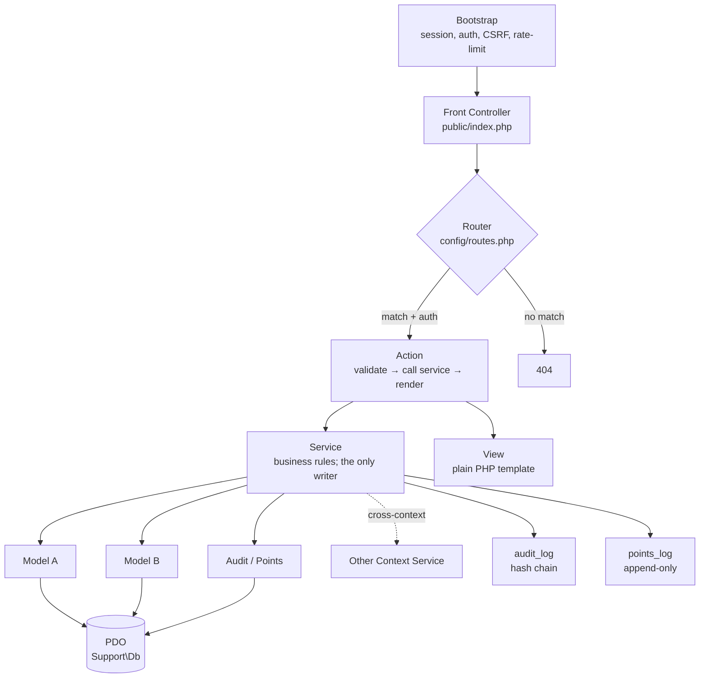
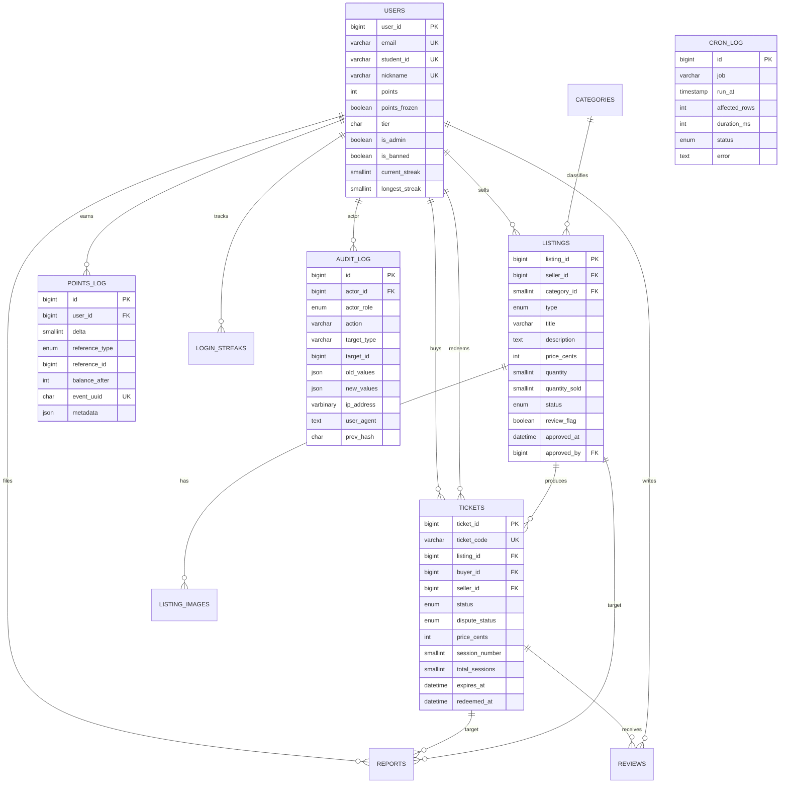

# Architecture Spine — TicketTrade

## Design Paradigm

**Layered Modular Monolith.** One PHP process per request, six layers in fixed order, bounded contexts at the top directory level.

| Layer | Lives in | Responsibility |
| --- | --- | --- |
| Bootstrap | `config/bootstrap.php` | Load config + autoload, start session, run auth guard, CSRF check, rate limit, request envelope |
| Front Controller | `public/index.php`, `public/admin/index.php` | Route resolution; nothing else enters the request |
| Action | `src/<Context>/Action/<name>_action.php` | Validate input; call Service; render View (thin) |
| Service | `src/<Context>/Service/<name>_service.php` | Business rules + multi-row transactions; **the only place state mutates** |
| Model | `src/<Context>/Model/<entity>_model.php` | Single-table data access; raw PDO via `Support\Db` |
| Persistence | `Support\Db` (PDO) | One connection per request, prepared statements, utf8mb4 |

The dependency arrow points strictly down: Bootstrap → FrontController → Action → Service → Model → Db. A Model never imports an Action. A Service never imports a Controller. A Context never imports another Context's Model — inter-context work goes through a Service that owns the cross-context transaction.

## Invariants & Rules



### AD-1 — Layered Modular Monolith paradigm

- **Binds:** all HTTP and cron code paths.
- **Prevents:** framework-shaped code creep; cross-context imports; Action doing business logic; Model doing validation.
- **Rule:** the dependency arrow is strictly downward. The linter (`phpcs` + a small custom rule, see Deferred) flags any upward import. A Context may call another Context's Service through its public namespace; never through its Model or Action.

### AD-2 — Top-level directories are bounded contexts

- **Binds:** every PHP file under `src/`.
- **Prevents:** two contexts writing the same row; admin code leaking into student code; secret leakage.
- **Rule:** contexts are `Auth`, `Listing`, `Ticket`, `Points`, `User`, `Category`, `Report`, `Admin`, `Cron`. Each owns `src/{Context}/{Action,Service,Model,View}/`. Cross-cutting code lives in `src/Support/` and never imports a Context. New context = new top-level dir + an entry in `config/contexts.php` only after AD-2 is amended.

### AD-3 — Single front controller; `src/` is outside webroot

- **Binds:** every HTTP request; deployment topology.
- **Prevents:** direct execution of an Action file; webroot traversal; source/config disclosure.
- **Rule:** webroot is `public/` only. The student entry is `public/index.php`; the admin entry is `public/admin/index.php`. nginx/Apache docroot points at `public/`. `src/`, `config/`, `jobs/`, `migrations/`, `data/`, `composer.json` are above webroot. The repo's `php -S` dev server is run from the project root with `public/` as the router (or with a tiny `router.php` in root, see Deferred).

### AD-4 — Hand-rolled router; explicit route list

- **Binds:** every screen on student and admin apps.
- **Prevents:** accidental public exposure of a protected screen; surprise method handling; one-off routing decisions in views.
- **Rule:** `config/routes.php` (student) and `admin/config/routes.php` (admin) hold a `route_name => { method, path, context, action, auth, csrf, rate_limit }` map. Looked up at front-controller boot; missing route renders 404 via `Support\Error\not_found()`. No regex, no auto-discovery. A new screen adds a row; a code review cannot accept a screen that isn't in the map.

### AD-5 — PDO with prepared statements; no ORM

- **Binds:** every database read and write.
- **Prevents:** SQL injection (PRD NFR-SEC-002); driver-mismatch bugs; magic strings in queries; typed-row drift.
- **Rule:** `Support\Db::pdo()` returns the single request-scoped PDO instance, configured `ERRMODE_EXCEPTION`, `EMULATE_PREPARES=false`, `DEFAULT_FETCH_MODE=FETCH_ASSOC`, charset `utf8mb4`. All SQL is `$stmt = Db::pdo()->prepare($sql); $stmt->execute([...]);`. No ORM, no query builder, no string concatenation in SQL. Reads return associative arrays; Models wrap them in a small DTO class but never expose the raw row.

### AD-6 — Versioned SQL migrations; idempotent runner

- **Binds:** schema lifecycle; environment parity.
- **Prevents:** divergent dev/prod schemas; ad-hoc column adds; lost schema history; "works on my machine".
- **Rule:** `migrations/{NNN_name}.sql` files plus a `migrations/.applied` set. `php migrate.php` runs missing files in lexical order inside a single transaction per file. Every migration is forward-only; corrections land as a new migration, never an edit. `migrate.php` is also runnable from `POST /admin/cron/migrate` behind admin re-auth.

### AD-7 — Inventory rule: `quantity_sold` is created-once

- **Binds:** `listings.quantity_sold`, `tickets.session_number`, `tickets.total_sessions`, expiry, dispute, Force Expire.
- **Prevents:** two writers racing on inventory (creation vs redemption); double-counting at handover; lost sessions on partial delivery; resurrection of stock on disputed tickets.
- **Rule:** `quantity_sold` increments ONLY inside the ticket-creation transaction. Redemption is a no-op for stock. Expiry (cron) and Force Expire (admin) decrement by `1` for products and by `total_sessions - (session_number - 1)` for services (FR-LST-012). If `quantity_sold` was zero before decrement, it stays zero (floor at zero). Listing reverts from `sold` to `active` when `quantity_sold < quantity` AND status was `sold`.

### AD-8 — Ticket code format

- **Binds:** `tickets.ticket_code`, redemption flow, WhatsApp share, dispute lookup.
- **Prevents:** enumerability from sequential IDs; sort-by-creation leakage; QR dependency; duplicate codes.
- **Rule:** `ticket_code = 'TK-' + base62(random_bytes(16))[:22]`; ≥125 bits of entropy; normative format `TK-XXXXXXXXXXXXXXXXXXXXXX`. Internal row IDs are `BIGINT UNSIGNED AUTO_INCREMENT`. `points_log.event_uuid` is UUID v7 via `ramsey/uuid`. Generation runs inside a retry loop on `UNIQUE` violation (max 10 attempts, then `E_TICKET_CODE_EXHAUSTED`).

### AD-9 — Atomic UPDATE for ticket state mutation

- **Binds:** redemption, service session confirm, dispute file, admin dispute resolution, cron expiry.
- **Prevents:** cross-seller redemption; double-redemption races; redemption of disputed tickets; partial-session out-of-order confirm.
- **Rule:** every state-changing ticket operation is a single `UPDATE tickets SET ... WHERE ticket_code = ? AND status = ? AND dispute_status != 'pending' AND seller_id = ?` (with the matching guard for the operation). `rowCount() === 0` is the "invalid" branch. No `SELECT FOR UPDATE`, no explicit transaction (PRD NFR-REL-004). Service session confirm additionally guards `session_number = ?` for sequential enforcement (FR-TKT-014). **Force Expire is the only ticket operation that overrides an open `dispute_status='pending'`**, restricted to the admin dispute-resolution path (FR-TKT-008); its WHERE is `status IN ('active','disputed')` and the action requires a `dispute_status` argument. All other state-changing operations keep the `dispute_status != 'pending'` guard.

### AD-10 — Points engine: append-only log + computed tier

- **Binds:** every point movement; rank badges; velocity flag; leaderboards; new-account multiplier; service final-session award.
- **Prevents:** lost or duplicated points; off-spec halving; points awarded before the handover; split-brain between `users.points` and the log; tier drift.
- **Rule:** every point movement writes a row to `points_log` (event_uuid UUID v7, `UNIQUE uniq_event`) AND updates `users.points` + `users.tier` in the same DB transaction. Tier is recomputed from `config/ranks.php` on every insert (PRD D7; 6-tier E→D→C→B→A→S). The Service is the only writer. Velocity check (>300 pts/day, >150 pts/hour per FR-ADM-009) runs at insert time and sets `users.points_frozen=TRUE` + writes an admin flag instead of rejecting. **FR-PTS-007 multiplier is new-account-only**: applies only to `reference_type='transaction'` rows AND only while the per-user counted-transaction count is `< 5`; verification/listing/streak/report/admin rows are never halved. The Points Service tracks the per-user counted-transaction count (PRD: "transaction N of 5 toward exiting the multiplier"); after the 5th counted transaction, transaction rows earn full points. **Pair-cap (PRD FR-ADM-009)** is per buyer-seller pair, not per user: at insert, count counted-transaction rows in `points_log` for the same `(actor_id, counterparty_id, DATE(event_at_Asia_Colombo))` tuple; if `>= 2`, set `metadata.pair_cap_hit=TRUE` and the row is logged but does NOT contribute to `users.points` (a 3rd ticket/day between the same pair is legitimate but uncounted). Service session confirm writes the points row ONLY on the final session (FR-TKT-014).

### AD-11 — Cron as first-class owner of three sweeps

- **Binds:** ticket expiry, 24h listing auto-approve, 3-day dispute auto-dismiss; daily leaderboard refresh; retention sweeps.
- **Prevents:** a 24h timer that depends on an admin being awake; forgotten ticket expiry; dispute pile-up; silent leaderboard staleness; retention gaps.
- **Rule:** `jobs/ticket_expiry.php` (hourly) is the single owner of (a) ticket expiry `active→expired` with stock decrement, (b) 24h listing auto-approve `pending→active` setting `approved_at=NOW(), approved_by=NULL`, and (c) 3-day dispute auto-dismiss `pending→rejected` — which writes `dispute_status='rejected'` and, only if `status='disputed'` is still set, flips it to `'active'`. The auto-dismiss never writes `expired` or `redeemed`; it closes the dispute window. If the auto-dismiss runs after the ticket has already cron-expired or admin-Force-Expired, the auto-dismiss is a no-op for `status` (PRD §4.2 composition note: a dismissed dispute on an already-expired ticket yields the existing expired state). `jobs/daily_cron.php` (02:00 Asia/Colombo) owns leaderboard summary refresh, daily/weekly report generation, streak recompute, retention marking. Both acquire `flock()` on `/tmp/<job>.lock`, log to `cron_log`, and are idempotent within the same wall-clock day. The 24h auto-approve is the documented cross-day non-idempotency exception (NFR-REL-002). Both jobs are also exposed at `POST /admin/cron/<job>` behind admin re-auth for manual trigger. All wall-clock comparisons run in `date_default_timezone_set('Asia/Colombo')`.

### AD-12 — Audit log is append-only with hash chain

- **Binds:** every admin and sensitive system action; tamper-evidence requirement (PRD FR-ADM-006).
- **Prevents:** silent edit/delete of admin actions; race-condition forks in the chain; non-repudiation holes.
- **Rule:** `audit_log` row carries `prev_hash = SHA256(prev.prev_hash || json_encode(<canonical key-sorted associative array of current_row>))`; the canonical key order is fixed in `Support\Audit::canonical_row()` so cross-environment chain verification produces identical hashes for the same logical row. Inserts serialize through MySQL named lock `GET_LOCK('audit_log_chain', 5)`. The chain is walked from the cached tip backward and re-verified for the last `K=1000` rows on every admin audit page render; a full re-walk is exposed as `POST /admin/cron/audit_reverify` behind admin re-auth. No `UPDATE` or `DELETE` against `audit_log` exists in code or via migration. Retention: `points_log` and `audit_log` kept indefinitely; `tickets` 1 year past `expires_at`/`redeemed_at`; `reports` 2 years (NFR-CMP-005).

### AD-13 — Auth, session, CSRF, rate-limit shape

- **Binds:** every state-changing request; every login attempt; every purchase; every redemption.
- **Prevents:** brute force; session fixation; CSRF on state changes; redemption-script flooding; cross-session data leakage.
- **Rule:** session config set at bootstrap: `use_strict_mode=1`, `sid_length=48`, `sid_bits_per_char=5`, `cookie_httponly=1`, `cookie_samesite=Strict`, `cookie_secure=1` (prod), `gc_maxlifetime=604800` (7 days). CSRF: per-session synchronizer token, `hash_equals()` compare, attached to every state-changing form and verified at the front controller. Rate limits (per-user AND per-IP, NFR-SEC-007): login 5/5min per IP, purchase 10/hr per user, listing_create 20/hr per user, points 150/day per user, redemption 5/hr per ticket. Rate-limit state stored in `cache_rate` table (or APCu if installed; default = DB row with TTL). A correct-code resubmission is idempotent and does NOT consume a redemption attempt (NFR-REL-001). **Security response headers (NFR-SEC-008)** are set by `Support\ResponseHeaders` at front-controller boot, before any Action runs: `X-Content-Type-Options: nosniff`, `X-Frame-Options: DENY`, `Referrer-Policy: strict-origin-when-cross-origin`, and a CSP of `default-src 'self'; script-src 'self' cdn.jsdelivr.net; style-src 'self' cdn.jsdelivr.net; img-src 'self' data:; connect-src 'self'; frame-ancestors 'none'; base-uri 'self'; form-action 'self'`. No Action may override these headers.

### AD-14 — File storage outside webroot; image proxy

- **Binds:** every listing image; every avatar.
- **Prevents:** hotlink of private images; EXIF/metadata leakage; polyglot uploads; webroot traversal; unauthorized full-size access.
- **Rule:** uploads land in `/var/www/uploads/listings/<sha256-hash-of-original>.webp` with three WebP 80% thumbnails (200/600/1200 per NFR-PER-003). `Support\ImageProxy` serves by id: thumbnails (200/600) are served unauthenticated to support guest browse (FR-LND-007) but are wrapped in the per-IP rate limit at 60/min/IP (AD-13). Full-size (1200) requires session AND one of: `current_user.user_id == listings.seller_id`, OR `current_user` has an `active` or `redeemed` ticket referencing the listing, OR `current_user.is_admin`. The check runs server-side on every full-size request; missing auth returns 404 (not 403, to avoid leaking listing existence). Validation pipeline runs in this order, each gate hard-fails on miss: `finfo` MIME allowlist → `getimagesize` ≤4000px and ≤5MB → magic bytes → GD re-encode to WebP. Default limits: 5MB/file, 2MB/chunk, 8 images/listing.

### AD-15 — Reviews and disputes gate on ticket state

- **Binds:** `reviews`, `tickets.dispute_status`, listing reputation (FR-RAT-001..005).
- **Prevents:** review-after-dispute gaming; dispute-on-redeemed-ticket edge cases; one party writing two reviews; review-while-listing-disputed.
- **Rule:** a review row can be inserted only when `tickets.status IN ('redeemed','expired') AND tickets.dispute_status='none'`. A dispute can be filed only when `tickets.status='active' AND tickets.dispute_status='none'`. `reviews UNIQUE (ticket_id, reviewer_role)` prevents two reviews from the same role. Public seller profile (FR-RAT-005) shows count only, never narrative.

### AD-16 — Failure envelope on every Action exit

- **Binds:** every Action response; every error path.
- **Prevents:** XSS via error message; leaky 500s; divergent error UX across screens; silent failures.
- **Rule:** Action returns `['ok' => bool, 'data' => mixed, 'error' => ['code' => string, 'message' => string, 'fields' => array|null]]`. View renders `error.message` only via `htmlspecialchars()`. Stable error codes (e.g. `E_AUTH_INVALID`, `E_LISTING_NOT_FOUND`, `E_RATE_LIMIT`, `E_CSRF`, `E_VALIDATION`, `E_TICKET_CODE_EXHAUSTED`) — UI switches on code, not on message text. Unhandled exceptions render a generic 500 page and write to `error_log`; no stack traces in HTML.

### AD-17 — Operational envelope

- **Binds:** deployment, dev tooling, observability.
- **Prevents:** cron-job double-runs; silent schema drift; lint rot; production-only behavior surprises; audit blind spots.
- **Rule:** dev server `php -S localhost:8000 -t public` (PRD NFR-OPS-001) with a `public/router.php` that maps every path to `public/index.php` (or `public/admin/index.php` for `/admin/*`). Migrations: `php migrate.php` (NFR-OPS-002). Cron: see AD-11. Lint: `vendor/bin/phpcs --standard=PSR12 src/` (NFR-OPS-005). Composer: `ramsey/uuid ^4.7` only at runtime; `phpcs`, `phpunit` as dev. All admin and sensitive system actions write an `audit_log` row (AD-12). Manual cron trigger requires admin re-auth (FR-ADM-008).

### AD-18 — Credentials are bcrypt-only at cost ≥ 12

- **Binds:** every user password write and read; the seeded admin password; the `users.password_hash` column; the student-ID allowlist (NFR-SEC-001, FR-AUTH-005, AGENTS.md Policy).
- **Prevents:** plaintext storage; md5/sha1/crypt/argon2-mixing in any code path; cost downgrade by a careless refactor; the team one `md5()` mistake away from a plaintext leak.
- **Rule:** `Auth/Service/auth_service.php` is the sole caller of `password_hash()` and `password_verify()`; cost constant lives in `config/auth.php` (default `12`). Every `INSERT` and `UPDATE` of `users.password_hash` MUST go through this Service; no Model, no migration, no seed script hashes outside it. The `Support\Crypto` namespace is the only place raw hash primitives (`hash`, `hash_hmac`, `hash_equals`) may live. A phpcs sniff (`Custom\Sniffs\NoRawHash`) rejects `md5(`, `sha1(`, `crypt(`, and `password_hash(` outside `Auth/Service/auth_service.php` and `Support\Crypto`. The student-ID allowlist is seeded with ~50 demo accounts; admins extend it from the users panel.

### AD-19 — Admin re-auth mechanism for sensitive actions

- **Binds:** every admin path covered by FR-ADM-008 / NFR-SEC-010 (ban, promote, demote, delete, bulk actions, manual cron trigger, audit chain re-verify, Force Expire on disputed tickets).
- **Prevents:** one screen, three re-auth implementations (re-login, modal, TOTP); cookie-only "are you still you?" check; the re-auth window expiring silently mid-flow.
- **Rule:** sensitive admin actions require a re-auth POST that includes the current admin's `password_hash` verified against `password_verify()` within the last `300` seconds (sliding). The re-auth result is cached server-side in `admin_reauth` table keyed by `(user_id, session_id)` with a `last_reauth_at` timestamp. Any sensitive Action whose `last_reauth_at` is older than `300s` renders a re-auth modal first; on success the timestamp updates and the original action proceeds. The re-auth flow itself is rate-limited at 5/min/IP. A "log out and back in" full path is NOT acceptable as the only mechanism (too disruptive for bulk actions).

### AD-20 — Cohort isolation is a go/no-go gate, not a Deferred

- **Binds:** every Model `SELECT`, `INSERT`, `UPDATE`, `DELETE`; every cache key; every leaderboard summary; every cron sweep.
- **Prevents:** two parallel cohorts sharing one DB and cross-leaking listings/tickets/points/leaderboards; the cost of retrofitting a `cohort_id` column + `WHERE` belt across every Model at sprint 3.
- **Rule (today):** the MVP assumes a single cohort; no `cohort_id` column is added and no `WHERE cohort_id = ?` belt is required. **At S2 retro (or earlier if a parallel cohort is announced)**, the team decides: (a) add `cohort_id` in migration `013` with `DEFAULT 'cohort-1'` and a `WHERE cohort_id = ?` clause in every Model, OR (b) confirm single-cohort for the demo window and re-defer. The decision MUST be made before any per-screen implementation work for FR-LST-005 (flyer modal) begins; a default at sprint 3 is a forced migration across every Story in flight. The deferred `WHERE cohort_id = ?` belt is listed in the Deferred list with this gate as the trigger.

## Consistency Conventions

| Concern | Convention |
| --- | --- |
| File / class / function names | snake_case files, PascalCase classes, snake_case functions (PSR-12) |
| Database identifiers | snake_case (`user_id`, `listing_id`, `created_at`, `price_cents`) |
| Money | integer cents only (`*_cents INT UNSIGNED`); never floats; display divides by 100 in the view |
| Time | `DATETIME` columns, stored UTC, displayed in `Asia/Colombo`; `date_default_timezone_set('Asia/Colombo')` at every entry point (web, cron) |
| IDs | `BIGINT UNSIGNED AUTO_INCREMENT` for table PKs; UUID v7 only for `points_log.event_uuid`; ticket codes per AD-8 |
| Error shape | `{ok, data, error:{code, message, fields?}}`; codes are stable strings, not localized text |
| State mutation | only through a Service; Model is data access only; Action is validate→call→render |
| Cross-context calls | Service → Service; never Model → Model across contexts |
| Logging | structured `error_log` (JSON line) for unhandled exceptions; `cron_log` for jobs; `audit_log` for admin actions; never `var_dump`/`print_r` in committed code |
| Config | read at bootstrap from `config/*.php` into a frozen `$config` array; no `env()` helper at MVP |
| Secrets | `config/db.php` is `.gitignored`; `config/.env.example` documents the swap to real credentials |
| Routes | one row per screen in `config/routes.php`; no regex, no auto-discovery |
| HTML output | `htmlspecialchars($s, ENT_QUOTES, 'UTF-8')` on every dynamic value; CSP via response header |
| SQL | `$pdo->prepare(...)` then `execute([...])`; never interpolated |

## Stack

| Name | Version | Notes |
| --- | --- | --- |
| PHP | 8.4.x (active support through 2027-12; security through 2029-12) — recommended; 8.3.x is acceptable (active through 2026-12, security through 2028-12) | assignment says PHP 8; 8.4 is the recommended pick; 8.3 hits security-only during the demo window so prefer 8.4 if the team can install it |
| MySQL | 8.4 LTS (8.0.x is past EOL on 2026-04-30; 8.4 is the only LTS with multi-year runway, EOL 2032-04) | InnoDB, utf8mb4 default |
| Composer | 2.x | PSR-4 autoload, namespace `App\` → `src/` |
| ramsey/uuid | ^4.7 (latest 4.9.3) | UUID v7 for `points_log.event_uuid` only |
| squizlabs/php_codesniffer | ^4.0 (latest 4.0.4) | dev only; PSR-12 |
| phpunit/phpunit | ^11.5 (latest 11.5.56; PHP 8.2+) | dev only; ^12 requires PHP 8.3+, ^13 requires PHP 8.4.1+ |
| Bootstrap | 5.3.8 (current 5.3.x; drop-in CDN swap from 5.3.3) | bundle locally for prod |
| JavaScript | vanilla ES2020, no build step | Uppy.js ^4 via CDN for chunked uploads; **client-side `@uppy/tus` chunkSize MUST be set to 2 MiB to match the server-side 2MB/chunk limit in AD-14** (`tus-js-client` default chunkSize is `Infinity`; without the override the first upload will hit the server limit on a single PUT) |
| Web server (dev) | `php -S` from project root, router in `public/` | production web server is nginx/Apache — see Deferred |
| OS / runtime | Linux (any), PHP-FPM or built-in server | Asia/Colombo timezone set in code, not OS |

## Structural Seed

```text
tickettrade/
  public/                              # webroot (AD-3)
    index.php                          # student front controller (AD-3)
    admin/
      index.php                        # admin front controller (AD-3)
    router.php                         # path-info router for php -S dev server (AD-17)
    assets/
      css/tickettrade.css
      img/                             # SVG icons only; listing images served via proxy
      js/                              # vanilla JS; no build
  src/
    Auth/
      Action/{login,logout,register,verify}_action.php
      Service/auth_service.php
      Model/user_model.php
      View/{login,register,home}.php
    Listing/
      Action/{browse,view,create,edit,delete,relist,buy}_action.php
      Service/listing_service.php
      Model/listing_model.php
      View/{board,detail,flyer,form,my_listings}.php
    Ticket/
      Action/{my_tickets,sales,redeem,confirm_session,dispute}_action.php
      Service/ticket_service.php
      Model/ticket_model.php
      View/{my_tickets,sales,detail}.php
    Points/
      Service/points_service.php       # AD-10: the only writer
      Model/points_log_model.php
    User/
      Action/{profile,edit_profile,public_profile}_action.php
      Service/user_service.php
      Model/user_model.php
      View/{profile,public_profile}.php
    Category/
      Service/category_service.php
      Model/category_model.php
    Report/
      Action/{file,my_reports}_action.php
      Service/report_service.php
      Model/report_model.php
    Admin/
      Action/{users,listings,reports,categories,audit,cron}_action.php
      Service/admin_service.php
      View/{dashboard,users,listings,reports,audit,analytics}.php
    Cron/
      Action/{manual_ticket_expiry,manual_daily_cron}_action.php   # wrap jobs/* for POST /admin/cron/*
    Support/                           # cross-cutting; never imports a Context (AD-2)
      Db.php                           # PDO singleton (AD-5)
      Auth.php                         # session, role guard, current user (AD-13)
      Csrf.php                         # token + verify (AD-13)
      RateLimit.php                    # per-user + per-IP (AD-13)
      ImageProxy.php                   # serve by id, role-checked (AD-14)
      ImageUpload.php                  # validation pipeline (AD-14)
      Audit.php                        # hash chain insert (AD-12)
      Error.php                        # 404/500 + envelope (AD-16)
      View.php                         # template include + htmlspecialchars wrapper
      Time.php                         # Asia/Colombo helpers
  config/
    bootstrap.php                      # session, autoload, error reporting
    db.php                             # .gitignored, PDO DSN + creds
    routes.php                         # student route map (AD-4)
    ranks.php                          # 6-tier ladder config (AD-10)
    rate_limits.php                    # named limit definitions (AD-13)
    contexts.php                       # bounded-context registry
  admin/
    config/
      routes.php                       # admin route map (AD-4)
  jobs/
    ticket_expiry.php                  # AD-11: hourly, 3 sweeps
    daily_cron.php                     # AD-11: 02:00 Asia/Colombo
  migrations/
    001_initial.sql
    002_users_auth.sql
    003_listings.sql
    004_tickets.sql
    005_reviews.sql
    006_points_log.sql
    007_reports.sql
    008_login_streaks.sql
    009_audit_log.sql
    010_cron_log.sql
    011_leaderboard_summaries.sql
    012_seed_demo.sql
  data/                                # outside webroot; runtime artifacts
    uploads/listings/                  # AD-14; outside webroot
  tests/
    Unit/{Context}/...
    Integration/...                    # boots a test DB, transaction-rolled-back per test
  composer.json
  package.json                         # optional; dev tooling only
  phpunit.xml
  phpcs.xml
  migrate.php                          # AD-6
  AGENTS.md
  README.md
```

## Core entity skeleton (ERD)



## Capability → Architecture Map

| Capability | Lives in | Governed by |
| --- | --- | --- |
| Registration + verification (FR-AUTH-001/003..006) | `Auth/Action/{register,verify,login,logout}_action.php`, `Auth/Service/auth_service.php`, `Auth/Model/user_model.php` | AD-2, AD-3, AD-13 |
| Listing CRUD (FR-LST-001..017) | `Listing/Action/*`, `Listing/Service/listing_service.php`, `Listing/Model/listing_model.php` | AD-2, AD-7, AD-14 |
| Browse + board view (FR-LST-003, FR-LND-001..008) | `Listing/Action/browse_action.php`, `Listing/View/board.php` | AD-3, AD-17 |
| Image upload pipeline (NFR-SEC-004, NFR-PER-003) | `Support/ImageUpload.php`, `Support/ImageProxy.php` | AD-14 |
| Purchase + ticket generation (FR-BUY-001, FR-TKT-001) | `Listing/Action/buy_action.php`, `Ticket/Service/ticket_service.php` | AD-2, AD-7, AD-8, AD-9 |
| Ticket display + WhatsApp share (FR-TKT-002/007) | `Ticket/Action/my_tickets_action.php`, `Ticket/View/*` | AD-3, AD-8, AD-16 |
| Redemption + per-session confirm (FR-TKT-003/004/014) | `Ticket/Action/{redeem,confirm_session}_action.php`, `Ticket/Service/ticket_service.php` | AD-9, AD-10, AD-13 |
| Dispute file + resolution (FR-TKT-008, FR-TKT-009) | `Ticket/Action/dispute_action.php`, `Admin/Action/reports_action.php`, `Admin/Service/admin_service.php` | AD-9, AD-15, AD-11 |
| Review + rating (FR-RAT-001..005) | `Ticket/Action/review_action.php`, `Ticket/Service/review_service.php` | AD-15, AD-16 |
| Points + ranks + velocity (FR-PTS-001..010) | `Points/Service/points_service.php`, `Points/Model/points_log_model.php`, `config/ranks.php` | AD-10, AD-12 |
| Login streaks | `User/Service/streak_service.php`, `Cron` | AD-11 |
| Leaderboards (FR-PTS-009) | `Support/Leaderboard.php` (read), `jobs/daily_cron.php` (write) | AD-11 |
| Admin moderation (FR-ADM-001..009) | `Admin/Action/*`, `Admin/Service/admin_service.php` | AD-2, AD-12, AD-13 |
| Admin re-auth (FR-ADM-008) | `Support/Auth.php` | AD-13 |
| Audit log + hash chain (FR-ADM-006) | `Support/Audit.php`, `Admin/Action/audit_action.php` | AD-12 |
| Cron expiry + auto-approve + auto-dismiss (NFR-OPS-003, FR-LST-007, FR-TKT-009) | `jobs/ticket_expiry.php` | AD-11 |
| Daily leaderboard refresh (NFR-OPS-004) | `jobs/daily_cron.php` | AD-11 |
| Image proxy (FR-LST-011, FR-LND-007) | `Support/ImageProxy.php` | AD-14 |
| Rate limits (NFR-SEC-007) | `Support/RateLimit.php`, `config/rate_limits.php` | AD-13 |
| CSRF (NFR-SEC-003) | `Support/Csrf.php` | AD-13 |
| Migrations (NFR-OPS-002) | `migrate.php`, `migrations/*.sql` | AD-6 |
| Data retention (NFR-CMP-005) | `jobs/daily_cron.php` retention sub-job | AD-12, AD-15 |

## Deferred

- **Production web server config (nginx/Apache).** PRD memo: deployment target is local demo. When the team cuts a real hosted demo, write a one-page `deploy.md` with a sample nginx server block pointing at `public/`, and add it as a non-normative appendix to the spine. Today: `php -S` only.
- **Custom phpcs rule for upward imports.** AD-1's "dependency arrow is strictly downward" is enforceable manually today; a `vendor/bin/phpcs` rule (or a `composer test:arch` script) that greps for `use App\{Context}\Action\` inside a Model/Service is the natural next step. Post-MVP unless lint rot bites during the 3-week build.
- **APCu for rate-limit storage.** Default is a `cache_rate` table row with TTL. If the install has APCu, switch the storage backend behind `Support/RateLimit`; the rule (per-user + per-IP) does not change. Tracked as a config swap, not an AD.
- **Email transport.** PRD says verification is SIMULATED. When a real SMTP appears, `Support/Mail.php` swaps the `mail()` call and `Auth/Service/auth_service.php` flips a feature flag.
- **Per-tenant cohort isolation.** If the cohort runs multiple parallel demos, an extra `cohort_id` column and a `WHERE cohort_id = ?` belt may be needed. Not needed at MVP.
- **Split admin DB connection.** Same connection with role guard is the default. A separate least-privilege admin user is a `config/db.php` change, not an AD.
- **Referrals.** PRD defers the referrals table; schema stub exists but no FRs hit it. Spine does not bind.
- **Real-time features.** The PRD makes no websocket/real-time claim. Polling on `My Tickets` is sufficient. If push becomes a requirement, AD-3's "single front controller" still holds; the addition is a long-poll endpoint or an SSE channel, not a paradigm shift.
- **i18n.** Copy is English-only at MVP per PRD memo; `Support/I18n.php` would be the natural home if and when it lands.
- **CORS / external API surface.** No public API. Internal AJAX on the same origin only. If a mobile client appears, AD-3 still holds; the addition is an `/api/` route prefix and a token guard, not a paradigm shift.
- **Service container / DI.** Hand-wired at MVP (`new Service(new Model())` in the Action). When the file count passes ~60, a small container becomes worth it — not before.
- **phpcs 4.x source repo move.** `squizlabs/php_codesniffer` 4.x continues as the package distribution; the upstream source repo moved to `PHPCSStandards/PHP_CodeSniffer`. The `composer require` line is unchanged; if a contributor greps the old repo for issues, point them to the new one.
